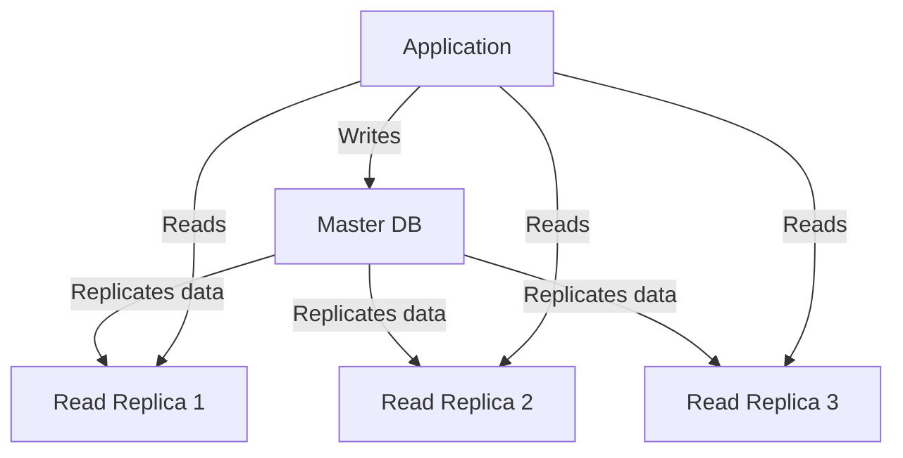
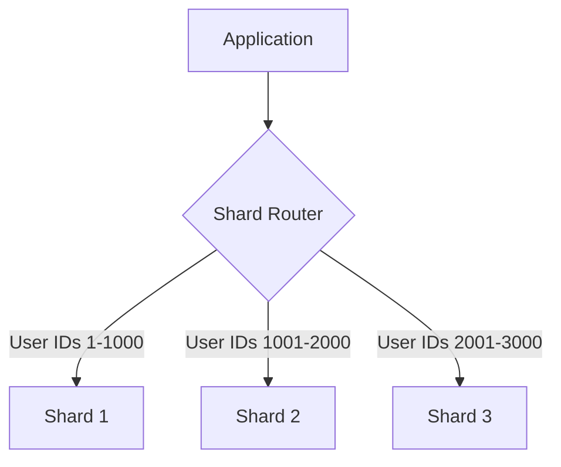
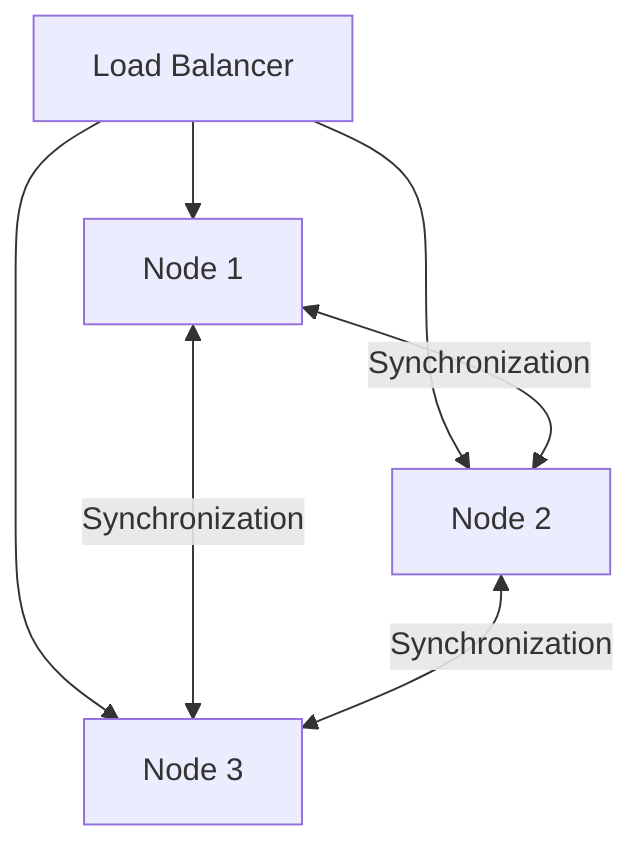

# SQL vs. NoSQL

In the world of databases, there are two main types of solutions:
SQL and NoSQL (or relational databases and non-relational databases).
Both of them differ in the way they were built, the kind of information they store, and the storage method they use.

Relational databases are structured and have predefined schemas like phone books that store phone numbers and addresses.
Non-relational databases are unstructured, distributed, and have a dynamic schema like file folders that hold everything from a person’s address and phone number to their Facebook ‘likes’ and online shopping preferences.

## SQL

Relational databases store data in rows and columns.
Each row contains all the information about one entity and each column contains all the separate data points.
Some of the most popular relational databases are MySQL, Oracle, MS SQL Server, SQLite, Postgres, and MariaDB.

## NoSQL

Following are the most common types of NoSQL:

**Key-Value Stores**:
Data is stored in an array of key-value pairs.
The ‘key’ is an attribute name which is linked to a ‘value’.
Well-known key-value stores include Redis, Voldemort, and Dynamo.

**Document Databases**:
In these databases, data is stored in documents (instead of rows and columns in a table) and these documents are grouped together in collections.
Each document can have an entirely different structure.
Document databases include the CouchDB and MongoDB.

**Wide-Column Databases**:
Instead of ‘tables,’ in columnar databases we have column families, which are containers for rows.
Unlike relational databases, we don’t need to know all the columns up front and each row doesn’t have to have the same number of columns.
Columnar databases are best suited for analyzing large datasets - big names include Cassandra and HBase.

**Graph Databases**:
These databases are used to store data whose relations are best represented in a graph.
Data is saved in graph structures with nodes (entities), properties (information about the entities), and lines (connections between the entities).
Examples of graph database include Neo4J and InfiniteGraph.

## High level differences between SQL and NoSQL

**Storage**:
SQL stores data in tables where each row represents an entity and each column represents a data point about that entity.
For example, if we are storing a car entity in a table, different columns could be ‘Color’, ‘Make’, ‘Model’, and so on.

NoSQL databases have different data storage models.
The main ones are key-value, document, graph, and columnar.
We will discuss differences between these databases below.

**Schema**:
In SQL, each record conforms to a fixed schema, meaning the columns must be decided and chosen before data entry and each row must have data for each column.
The schema can be altered later, but it involves modifying the whole database and going offline.

In NoSQL, schemas are dynamic.
Columns can be added on the fly and each ‘row’ (or equivalent) doesn’t have to contain data for each ‘column.’

**Querying**:
SQL databases use SQL (structured query language) for defining and manipulating the data, which is very powerful.

In a NoSQL database, queries are focused on a collection of documents.
Sometimes it is also called UnQL (Unstructured Query Language).
Different databases have different syntax for using UnQL.

**Scalability**:
In most common situations, SQL databases are vertically scalable, i.e., by increasing the horsepower (higher Memory, CPU, etc.) of the hardware, which can get very expensive.
It is possible to scale a relational database across multiple servers, but this is a challenging and time-consuming process.

On the other hand, NoSQL databases are horizontally scalable, meaning we can add more servers easily in our NoSQL database infrastructure to handle a lot of traffic.
Any cheap commodity hardware or cloud instances can host NoSQL databases, thus making it a lot more cost-effective than vertical scaling.
A lot of NoSQL technologies also distribute data across servers automatically.

**Reliability or ACID Compliancy (Atomicity, Consistency, Isolation, Durability)**:
The vast majority of relational databases are ACID compliant.
So, when it comes to data reliability and safe guarantee of performing transactions, SQL databases are still the better bet.

Most of the NoSQL solutions sacrifice ACID compliance for performance and scalability.

## SQL VS. NoSQL - Which one to use?

When it comes to database technology, there’s no one-size-fits-all solution. That’s why many businesses rely on both relational and non-relational databases for different needs. Even as NoSQL databases are gaining popularity for their speed and scalability, there are still situations where a highly structured SQL database may perform better; choosing the right technology hinges on the use case.

### Reasons to use SQL database

Here are a few reasons to choose a SQL database:

1. We need to ensure ACID compliance. ACID compliance reduces anomalies and protects the integrity of your database by prescribing exactly how transactions interact with the database. Generally, NoSQL databases sacrifice ACID compliance for scalability and processing speed, but for many e-commerce and financial applications, an ACID-compliant database remains the preferred option.
2. Your data is structured and unchanging. If your business is not experiencing massive growth that would require more servers and if you’re only working with data that is consistent, then there may be no reason to use a system designed to support a variety of data types and high traffic volume.

### Reasons to use NoSQL database

When all the other components of our application are fast and seamless, NoSQL databases prevent data from being the bottleneck. Big data is contributing to a large success for NoSQL databases, mainly because it handles data differently than the traditional relational databases. A few popular examples of NoSQL databases are MongoDB, CouchDB, Cassandra, and HBase.

1. Storing large volumes of data that often have little to no structure. A NoSQL database sets no limits on the types of data we can store together and allows us to add new types as the need changes. With document-based databases, you can store data in one place without having to define what “types” of data those are in advance.
2. Making the most of cloud computing and storage. Cloud-based storage is an excellent cost-saving solution but requires data to be easily spread across multiple servers to scale up. Using commodity (affordable, smaller) hardware on-site or in the cloud saves you the hassle of additional software and NoSQL databases like Cassandra are designed to be scaled across multiple data centers out of the box, without a lot of headaches.
3. Rapid development. NoSQL is extremely useful for rapid development as it doesn’t need to be prepped ahead of time. If you’re working on quick iterations of your system which require making frequent updates to the data structure without a lot of downtime between versions, a relational database will slow you down.

## Is it really true that SQL are generally vertically scalable only, whilst NoSQL databases are horizontally scalable?

This statement is a common generalization about SQL and NoSQL databases, but it's not entirely accurate. Let's break it down and examine the nuances:

1. SQL databases and vertical scaling:
   It's true that traditionally, SQL databases were primarily designed for vertical scaling. This is because:

- SQL databases often rely on ACID (Atomicity, Consistency, Isolation, Durability) properties, which can be challenging to maintain across distributed systems.
- Many SQL databases use a single-master architecture, where write operations are centralized.

However, modern SQL databases have evolved:

- Many SQL databases now support horizontal scaling through various techniques:
  - Read replicas for distributing read operations
  - Sharding for distributing data across multiple servers
  - Clustering for high availability and load balancing

Examples of horizontally scalable SQL databases include:

- Amazon Aurora
- Google Cloud Spanner
- CockroachDB
- Vitess (a scaling solution for MySQL)

2. NoSQL databases and horizontal scaling:
   It's generally true that many NoSQL databases were designed with horizontal scaling in mind from the beginning. This is because:

- Many NoSQL databases sacrifice some ACID properties (usually consistency) for better partition tolerance and availability (CAP theorem).
- They often use distributed architectures by default.

However, it's important to note:

- Not all NoSQL databases are created equal. Some may still have limitations in horizontal scaling.
- Proper horizontal scaling often requires careful planning and configuration, even for NoSQL databases.

3. The reality of scalability:
   The truth is that the scalability of a database depends on various factors:

- The specific database product and version
- The use case and data model
- The scaling techniques employed
- The infrastructure and resources available

Both SQL and NoSQL databases can be scaled horizontally or vertically, depending on the specific requirements and constraints of the system.

4. Why this misconception persists:
   This generalization likely stems from:

- Historical differences in database design philosophies
- The initial challenges of scaling traditional SQL databases horizontally
- The marketing of many NoSQL solutions as "web-scale" or "cloud-native"

In conclusion, while there's some truth to the statement that NoSQL databases are often easier to scale horizontally out of the box, it's an oversimplification. Modern database systems, both SQL and NoSQL, offer various scaling options. The choice between SQL and NoSQL should be based on specific requirements, including data model, consistency needs, and query patterns, rather than solely on perceived scalability differences.

## More about SQL horizontal scaling strategies

1. Read Replication:

Read replication involves creating copies (replicas) of a database that can handle read queries. Here's how it works:

- The primary database (master) handles all write operations.
- Data is continuously replicated from the master to one or more read replicas.
- Read queries are distributed across these replicas, reducing load on the master.

Benefits:

- Improves read performance and scalability
- Provides fault tolerance and high availability
- Allows for geographic distribution of data

Challenges:

- Potential for replication lag
- Increased complexity in managing multiple database instances
- Read replicas are eventually consistent, which may not be suitable for all use cases

2. Sharding:

Sharding is a technique that involves horizontally partitioning data across multiple databases or servers. Each partition is called a shard.

Key concepts:

- Sharding key: The attribute used to determine which shard a piece of data belongs to (e.g., user ID, geographic location).
- Shard router: A component that directs queries to the appropriate shard based on the sharding key.

Benefits:

- Allows for horizontal scaling of writes and reads
- Can improve query performance by reducing the dataset size per shard
- Enables data distribution across geographic regions

Challenges:

- Increased complexity in application logic and database management
- Potential for uneven data distribution (hotspots)
- Challenges with operations that span multiple shards (e.g., JOIN operations, transactions)

3. Clustering:

Clustering involves grouping multiple database servers to work together as a single system. There are various clustering architectures, but a common one is the active-active cluster.

Key aspects of clustering:

- Multiple nodes work together to handle read and write operations
- Data is synchronized across all nodes to maintain consistency
- A load balancer distributes incoming requests across the nodes

Benefits:

- High availability and fault tolerance
- Improved performance through load distribution
- Scalability for both reads and writes

Challenges:

- Complexity in maintaining data consistency across nodes
- Potential for split-brain scenarios in case of network partitions
- Higher hardware and operational costs

Each of these techniques can be used individually or in combination, depending on the specific requirements of the system. For example, a large-scale application might use sharding for data distribution, with each shard implemented as a cluster for high availability, and read replicas for each cluster to handle read-heavy workloads.

The choice and implementation of these scaling techniques depend on factors such as the expected growth of data and traffic, consistency requirements, geographic distribution needs, and the specific strengths and limitations of the chosen database system.

## Are NoSQL databases broadly better for scalably storing large datasets?

NoSQL databases are often considered better for scalably storing large amounts of data, but this perception is somewhat oversimplified. Let's explore the reasons behind this belief and examine the nuances:

| Characteristic    | SQL                              | NoSQL                                    |
| ----------------- | -------------------------------- | ---------------------------------------- |
| Data Model        | Rigid, predefined schema         | Flexible, schema-less or dynamic schema  |
| Consistency       | Strong consistency (ACID)        | Often eventual consistency (BASE)        |
| Scalability       | Traditionally vertical, now both | Designed for horizontal scalability      |
| Joins             | Supports complex joins           | Limited or no join support               |
| Data Distribution | Can be complex                   | Often built-in and automatic             |
| Use Cases         | Complex queries, transactions    | High write throughput, unstructured data |

Now, let's break down the reasons why NoSQL is often considered better for scalable data storage:

1. Flexible Data Models:

   - NoSQL databases often use flexible schemas (or no schema), allowing for easier changes to data structures.
   - This flexibility can be advantageous when dealing with large amounts of unstructured or semi-structured data.
   - SQL databases, with their rigid schemas, can be more challenging to modify as data needs evolve.

2. Horizontal Scalability:

   - Many NoSQL databases are designed from the ground up for horizontal scalability (adding more machines).
   - They often include built-in features for data distribution and replication across multiple nodes.
   - While modern SQL databases can scale horizontally, it often requires more complex configuration.

3. Performance at Scale:

   - NoSQL databases often sacrifice some ACID properties (usually strong consistency) for better performance and availability.
   - This can result in faster write operations, which is crucial for handling high volumes of data.

4. Distributed Architecture:

   - Many NoSQL databases use a masterless or multi-master architecture, allowing writes to any node.
   - This can improve write throughput and reduce bottlenecks compared to traditional single-master SQL systems.

5. Simplified Data Distribution:

   - NoSQL databases often handle data sharding and rebalancing automatically.
   - This can make it easier to add or remove nodes from the cluster as data volume grows.

6. Optimized for Specific Use Cases:
   - Different types of NoSQL databases (document, key-value, column-family, graph) are optimized for specific data models and access patterns.
   - This specialization can lead to better performance for certain types of large-scale applications.

However, it's important to note some caveats:

1. SQL Databases Have Evolved:

   - Modern SQL databases have incorporated many scalability features traditionally associated with NoSQL.
   - Examples include Amazon Aurora, Google Cloud Spanner, and CockroachDB, which offer horizontal scalability and distributed architectures.

2. Trade-offs:

   - The scalability of NoSQL often comes at the cost of strong consistency or complex query capabilities.
   - For applications that require ACID transactions or complex joins, a SQL database might still be preferable.

3. Operational Complexity:

   - While NoSQL databases can simplify some aspects of scaling, they may introduce new operational challenges.
   - Managing eventual consistency and dealing with distributed system issues can be complex.

4. Use Case Dependency:
   - The "better" option heavily depends on the specific use case, data model, and access patterns of the application.
   - NoSQL excels in scenarios with high write throughput, flexible data models, and where eventual consistency is acceptable.

In conclusion, while NoSQL databases offer several advantages for storing and scaling large amounts of data, the choice between SQL and NoSQL should be based on a careful analysis of your specific requirements. Both types of databases have their strengths, and modern database systems often blur the lines between the two categories. The key is to understand your data, your scalability needs, and the trade-offs involved in each approach.
