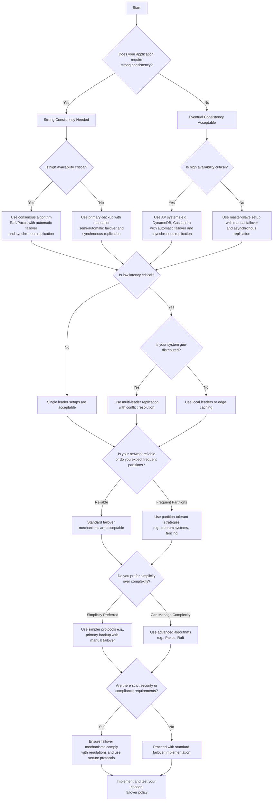

# Leader Failover

<!--toc:start-->

- [Leader Failover](#leader-failover)
  - [Graph](#graph)
    - [**Decision Tree for Selecting a Failover Policy**](#decision-tree-for-selecting-a-failover-policy)
      - [**1. Consistency Requirements**](#1-consistency-requirements)
      - [**2A. Strong Consistency Path**](#2a-strong-consistency-path)
        - [**2A.1. Availability Needs**](#2a1-availability-needs)
        - [**2A.1.1. High Availability Critical**](#2a11-high-availability-critical)
        - [**2A.1.2. Downtime Acceptable**](#2a12-downtime-acceptable)
      - [**2B. Eventual Consistency Path**](#2b-eventual-consistency-path)
        - [**2B.1. Availability Needs**](#2b1-availability-needs)
        - [**2B.1.1. High Availability Critical**](#2b11-high-availability-critical)
        - [**2B.1.2. Downtime Acceptable**](#2b12-downtime-acceptable)
      - [**3. Latency Constraints**](#3-latency-constraints)
      - [**4. Network Reliability**](#4-network-reliability)
      - [**5. Geo-Distribution**](#5-geo-distribution)
      - [**6. Operational Complexity and Resources**](#6-operational-complexity-and-resources)
      - [**7. Security and Compliance Requirements**](#7-security-and-compliance-requirements)
    - [**Summary of Recommendations**](#summary-of-recommendations)
    - [**Additional Considerations**](#additional-considerations)
      - [**Replication Modes**](#replication-modes)
      - [**Leader Election Algorithms**](#leader-election-algorithms)
      - [**Failover Mechanisms**](#failover-mechanisms)
    - [**Example Scenarios**](#example-scenarios)
      - [**Scenario 1: Financial Transactions System**](#scenario-1-financial-transactions-system)
      - [**Scenario 2: Global Social Media Platform**](#scenario-2-global-social-media-platform)
      - [**Scenario 3: Internal Logging System**](#scenario-3-internal-logging-system)
    - [**Implementing the Chosen Policy**](#implementing-the-chosen-policy)
    - [**Key Trade-Offs to Embrace**](#key-trade-offs-to-embrace)
    - [**Conclusion**](#conclusion)
    - [**Contextual Factors to Consider**](#contextual-factors-to-consider)
      - [**1. Consistency Requirements**](#1-consistency-requirements)
      - [**2. Availability Needs**](#2-availability-needs)
      - [**3. Latency Constraints**](#3-latency-constraints)
      - [**4. Network Reliability**](#4-network-reliability)
      - [**5. Data Center Topology**](#5-data-center-topology)
      - [**6. Failure Modes and Detection**](#6-failure-modes-and-detection)
      - [**7. Replication Strategy**](#7-replication-strategy)
      - [**8. Load Characteristics**](#8-load-characteristics)
      - [**9. Leader Election Mechanisms**](#9-leader-election-mechanisms)
      - [**10. Quorum Configurations**](#10-quorum-configurations)
      - [**11. Idempotency and State Management**](#11-idempotency-and-state-management)
      - [**12. Client Behavior and Failover Transparency**](#12-client-behavior-and-failover-transparency)
      - [**13. Security and Compliance**](#13-security-and-compliance)
      - [**14. Operational Complexity**](#14-operational-complexity)
      - [**15. Future Scalability**](#15-future-scalability)
    - [**Options to Consider for Failover Policies**](#options-to-consider-for-failover-policies)
      - [**1. Automatic vs. Manual Failover**](#1-automatic-vs-manual-failover)
      - [**2. Leader Election Algorithms**](#2-leader-election-algorithms)
      - [**3. Failure Detection Mechanisms**](#3-failure-detection-mechanisms)
      - [**4. Replication Modes**](#4-replication-modes)
      - [**5. Quorum-Based Systems**](#5-quorum-based-systems)
      - [**6. Fencing Mechanisms**](#6-fencing-mechanisms)
      - [**7. Delayed Failover**](#7-delayed-failover)
      - [**8. Split-Brain Resolution**](#8-split-brain-resolution)
      - [**9. Client-Side Strategies**](#9-client-side-strategies)
      - [**10. Multi-Data Center Failover**](#10-multi-data-center-failover)
      - [**11. Monitoring and Alerting**](#11-monitoring-and-alerting)
      - [**12. Testing and Validation**](#12-testing-and-validation)
      - [**13. Prioritization of Nodes**](#13-prioritization-of-nodes)
      - [**14. Data Reconciliation**](#14-data-reconciliation)
      - [**15. Security Measures**](#15-security-measures)
    - [**Implementing the Failover Policy**](#implementing-the-failover-policy)
    - [**Conclusion**](#conclusion)
  - [Thought process](#thought-process)
  <!--toc:end-->

## Graph



### **Decision Tree for Selecting a Failover Policy**

The decision tree is structured around critical decision points that influence the choice of failover policy and algorithms. At each node, you'll assess your system's needs to arrive at the most appropriate strategy.

---

#### **1. Consistency Requirements**

**Question:** Does your application require **strong consistency** or is **eventual consistency** acceptable?

- **Strong Consistency Needed**
  - Proceed to **Section 2A**.
- **Eventual Consistency Acceptable**
  - Proceed to **Section 2B**.

---

#### **2A. Strong Consistency Path**

##### **2A.1. Availability Needs**

**Question:** Is **high availability** critical, or can you tolerate some downtime during failover?

- **High Availability Critical**
  - Proceed to **2A.1.1**.
- **Downtime Acceptable**
  - Proceed to **2A.1.2**.

##### **2A.1.1. High Availability Critical**

**Recommendation:** Use a **consensus algorithm** that ensures strong consistency and automatic failover.

- **Adopt Raft or Paxos:**
  - **Raft**: Simpler to implement and understand; good for most applications.
  - **Paxos**: More complex but offers higher fault tolerance; suitable for critical systems.
- **Implement Automatic Failover:**
  - Leader election is handled automatically among nodes.
- **Replication Strategy:**
  - Use **synchronous replication** to ensure data consistency.
- **Quorum-Based Writes:**
  - Requires a majority of nodes to agree, enhancing consistency but possibly affecting latency.

**Trade-Offs:**

- **Pros:**
  - Maintains strong consistency.
  - Provides high availability with minimal downtime.
- **Cons:**
  - Increased complexity in implementation.
  - Potentially higher latency due to synchronous replication and quorum requirements.

##### **2A.1.2. Downtime Acceptable**

**Recommendation:** Use a **primary-backup approach** with **manual or semi-automatic failover**.

- **Manual Failover:**
  - Operators intervene to promote a backup to leader.
- **Semi-Automatic Failover:**
  - Use tools that assist in failover but require confirmation.
- **Replication Strategy:**
  - **Synchronous replication** to backups to ensure data is consistent before failover.

**Trade-Offs:**

- **Pros:**
  - Simpler to implement.
  - Strong consistency is maintained.
- **Cons:**
  - Increased downtime during failover.
  - Requires human intervention or more complex tooling.

---

#### **2B. Eventual Consistency Path**

##### **2B.1. Availability Needs**

**Question:** Is **high availability** critical, or can you tolerate some downtime?

- **High Availability Critical**
  - Proceed to **2B.1.1**.
- **Downtime Acceptable**
  - Proceed to **2B.1.2**.

##### **2B.1.1. High Availability Critical**

**Recommendation:** Use **AP systems** (Availability and Partition tolerance) from the CAP theorem, such as **Dynamo-style databases**.

- **Implement Gossip Protocols:**
  - Nodes share state information to achieve eventual consistency.
- **Automatic Failover:**
  - Any node can handle requests; no strict leader.
- **Replication Strategy:**
  - Use **asynchronous replication** to improve availability and performance.

**Trade-Offs:**

- **Pros:**
  - High availability and partition tolerance.
  - Low latency due to local reads/writes.
- **Cons:**
  - Data may not be immediately consistent.
  - Complex conflict resolution mechanisms may be required.

##### **2B.1.2. Downtime Acceptable**

**Recommendation:** Use a **simplified master-slave setup** with **asynchronous replication**.

- **Manual Failover:**
  - Operators promote a slave to master when needed.
- **Replication Strategy:**
  - **Asynchronous replication** for better performance.

**Trade-Offs:**

- **Pros:**
  - Simpler implementation.
  - Better performance due to asynchronous replication.
- **Cons:**
  - Possible data loss if the master fails before slaves catch up.
  - Downtime during failover.

---

#### **3. Latency Constraints**

**Question:** Is **low latency** critical for your application?

- **Yes, Low Latency is Critical**
  - Consider **local leaders** or **multi-leader replication**.
- **No, Latency Can Be Higher**
  - Single leader setups are acceptable.

**Multi-Leader Replication:**

- **Use Cases:**
  - Geographically distributed systems needing low latency in each region.
- **Trade-Offs:**
  - **Pros:**
    - Low local latency.
    - High availability.
  - **Cons:**
    - Conflict resolution becomes complex.
    - Eventual consistency between regions.

---

#### **4. Network Reliability**

**Question:** Is your network **reliable**, or do you expect **frequent partitions**?

- **Reliable Network**
  - Less stringent measures needed for failover.
- **Frequent Partitions**
  - Proceed to **Partition-Tolerant Strategies**.

**Partition-Tolerant Strategies:**

- **Use Consensus Algorithms with Partition Tolerance:**
  - **Etcd or ZooKeeper** for coordination.
- **Implement Fencing Tokens:**
  - Prevent split-brain scenarios.
- **Trade-Offs:**
  - **Pros:**
    - Maintains system operation during partitions.
  - **Cons:**
    - May need to sacrifice consistency or availability per CAP theorem.

---

#### **5. Geo-Distribution**

**Question:** Is your system **spread over multiple regions**?

- **Yes, Multi-Region Deployment**
  - Consider **Geo-Distributed Consensus Algorithms** or **Multi-Leader Replication**.
- **No, Single Region**
  - Single leader strategies are sufficient.

**Geo-Distributed Consensus Algorithms:**

- **Examples:**
  - **Spanner by Google** uses TrueTime API for global consistency.
- **Trade-Offs:**
  - **Pros:**
    - Strong consistency across regions.
  - **Cons:**
    - High complexity.
    - Increased latency due to cross-region communication.

---

#### **6. Operational Complexity and Resources**

**Question:** Can your team **manage complex systems**, or do you prefer **simpler solutions**?

- **Can Manage Complexity**
  - Advanced algorithms like **Paxos** or **Raft** are acceptable.
- **Prefer Simplicity**
  - Use simpler protocols like **Bully Algorithm** or **Heartbeat Mechanisms**.

---

#### **7. Security and Compliance Requirements**

**Question:** Do you have **strict security or compliance requirements**?

- **Yes**
  - Ensure failover mechanisms comply with regulations.
  - Use **secure consensus protocols**.
- **No**
  - Standard failover mechanisms are acceptable.

---

### **Summary of Recommendations**

Based on your answers to the above questions, you can narrow down your options:

- **Strong Consistency & High Availability:**
  - **Use Raft or Paxos with Automatic Failover.**
- **Eventual Consistency & High Availability:**
  - **Use AP Systems like DynamoDB, Cassandra.**
- **Low Latency Critical:**
  - **Implement Multi-Leader Replication with Conflict Resolution Mechanisms.**
- **Geo-Distributed System:**
  - **Use Geo-Distributed Consensus Algorithms or Multi-Leader Replication.**
- **Prefer Simplicity:**
  - **Use Primary-Backup with Manual Failover and Asynchronous Replication.**

---

### **Additional Considerations**

#### **Replication Modes**

- **Synchronous Replication:**
  - Ensures data is written to replicas before acknowledging success.
  - **Use When:**
    - Data loss is unacceptable.
    - Can tolerate increased write latency.
- **Asynchronous Replication:**
  - Writes are acknowledged before being replicated.
  - **Use When:**
    - Performance is critical.
    - Some data loss is acceptable in extreme cases.

#### **Leader Election Algorithms**

- **Raft:**
  - Easier to implement and understand.
  - **Suitable For:**
    - Systems requiring strong consistency with moderate complexity.
- **Paxos:**
  - Highly fault-tolerant.
  - **Suitable For:**
    - Systems where fault tolerance is paramount and complexity can be managed.
- **Zab (ZooKeeper Atomic Broadcast):**
  - Used in Apache ZooKeeper.
  - **Suitable For:**
    - Coordination services needing reliable leader election.

#### **Failover Mechanisms**

- **Automatic Failover:**
  - **Pros:**
    - Minimal downtime.
    - No human intervention required.
  - **Cons:**
    - Risk of split-brain if not properly implemented.
- **Manual Failover:**
  - **Pros:**
    - Human oversight can prevent erroneous failovers.
  - **Cons:**
    - Increased downtime.
    - Dependent on personnel availability.

---

### **Example Scenarios**

#### **Scenario 1: Financial Transactions System**

- **Requirements:**
  - Strong consistency.
  - High availability.
  - Low latency within a region.
- **Recommendation:**
  - Use **Raft** with synchronous replication and automatic failover.
  - Deploy in a single region to minimize latency.
  - Implement robust monitoring and quick failover detection.

#### **Scenario 2: Global Social Media Platform**

- **Requirements:**
  - Eventual consistency acceptable.
  - High availability.
  - Global low latency.
- **Recommendation:**
  - Use **Multi-Leader Replication** with asynchronous replication.
  - Implement conflict resolution strategies.
  - Use local leaders in each region to serve local traffic.

#### **Scenario 3: Internal Logging System**

- **Requirements:**
  - Eventual consistency.
  - Downtime acceptable during off-peak hours.
  - Simplicity preferred.
- **Recommendation:**
  - Use **Primary-Backup** setup with manual failover.
  - Asynchronous replication to reduce overhead.
  - Simple heartbeat mechanism for failure detection.

---

### **Implementing the Chosen Policy**

Once you've selected a failover policy:

1. **Design the Architecture:**
   - Outline the components and how they interact.
2. **Configure Consensus Algorithms:**
   - Set up Raft, Paxos, or other algorithms as per your choice.
3. **Set Replication Modes:**
   - Configure synchronous or asynchronous replication.
4. **Establish Failure Detection:**
   - Implement heartbeats, timeouts, and monitoring tools.
5. **Test Failover Scenarios:**
   - Simulate node failures to ensure failover works as expected.
6. **Implement Client-Side Logic:**
   - Ensure clients can discover the new leader after failover.
7. **Secure the System:**
   - Use encryption and authentication to protect leader election and data replication.
8. **Document Procedures:**
   - Have clear guidelines for operational staff.

---

### **Key Trade-Offs to Embrace**

- **Consistency vs. Availability:**
  - Decide whether to prioritize immediate data accuracy or system uptime.
- **Latency vs. Consistency:**
  - Low latency might require accepting eventual consistency.
- **Complexity vs. Manageability:**
  - Advanced algorithms offer benefits but require more resources to manage.
- **Automatic vs. Manual Failover:**
  - Automatic failover reduces downtime but can introduce complexity and risks.

---

### **Conclusion**

By following this decision tree, you can systematically evaluate your system's requirements and make informed choices about your failover policy for the leader node in a replicated database. This approach helps you balance the critical trade-offs inherent in distributed systems, ensuring that your failover strategy aligns with your application's needs and your organization's capabilities.

Remember that the ideal failover policy is context-dependent. Regularly revisit your decisions as your system evolves, load patterns change, or new technologies become available. Continuous evaluation and adaptation are key to maintaining a resilient and efficient distributed system.

---

**Final Note:**

Designing failover policies is a complex task that often requires iterative testing and refinement. Engage with stakeholders, including developers, operations teams, and business units, to ensure that the chosen strategy meets both technical and business objectives. Consider conducting pilot implementations or proofs of concept to validate your decisions before full-scale deployment.

### **Contextual Factors to Consider**

Understanding the specific context of your distributed system is crucial for making informed decisions about failover policies. Here are the key factors to take into account:

#### **1. Consistency Requirements**

- **Data Consistency Model**: Determine if your application requires strong consistency (e.g., linearizability) or if eventual consistency suffices.
- **Consistency vs. Availability**: Consider the CAP theorem, which states that a distributed system can only guarantee two out of three properties: Consistency, Availability, and Partition Tolerance.
- **Read and Write Patterns**: Analyze how reads and writes are distributed. High write loads might necessitate different strategies compared to read-heavy systems.

#### **2. Availability Needs**

- **Uptime Expectations**: Define acceptable downtime during leader failover. Mission-critical systems often require near-zero downtime.
- **Redundancy Levels**: Decide on the number of replicas to tolerate failures without affecting availability.

#### **3. Latency Constraints**

- **User Experience**: Understand the maximum acceptable latency for end-users, especially during failover.
- **Geographical Distribution**: Account for latency introduced by data centers spread across regions.

#### **4. Network Reliability**

- **Network Partitions**: Assess the likelihood of network splits and how they might affect leader election.
- **Bandwidth and Latency**: Ensure the network can handle replication traffic without significant delays.

#### **5. Data Center Topology**

- **Single vs. Multi-Region Deployment**: Multi-region deployments introduce complexities like higher latency and compliance with regional laws.
- **Failure Domains**: Identify if failures are likely to be isolated (e.g., rack-level) or widespread (e.g., data center-level).

#### **6. Failure Modes and Detection**

- **Types of Failures**: Prepare for hardware failures, software bugs, and human errors.
- **Failure Detection Mechanisms**: Implement reliable methods to detect node and network failures promptly.

#### **7. Replication Strategy**

- **Synchronous Replication**: Guarantees data consistency but can increase latency.
- **Asynchronous Replication**: Improves performance but risks data loss during failover.
- **Hybrid Approaches**: Use a mix of both to balance performance and consistency.

#### **8. Load Characteristics**

- **Peak vs. Average Load**: Design the failover policy to handle peak loads without degradation.
- **Transactional Requirements**: Consider if transactions need to be atomic across the system.

#### **9. Leader Election Mechanisms**

- **Algorithm Choice**: Select from consensus algorithms like Raft, Paxos, or simpler methods depending on system complexity.
- **Election Criteria**: Define what makes a node eligible to become a leader (e.g., most up-to-date data, node priority).

#### **10. Quorum Configurations**

- **Read and Write Quorums**: Determine the minimum number of nodes required to approve operations, affecting consistency and availability.
- **Dynamic Quorums**: Adjust quorum sizes based on node availability.

#### **11. Idempotency and State Management**

- **Idempotent Operations**: Ensure that operations can be retried without adverse effects, which is vital during failovers.
- **State Synchronization**: Plan for state transfer between nodes to maintain consistency.

#### **12. Client Behavior and Failover Transparency**

- **Leader Discovery**: Implement mechanisms for clients to locate the new leader after failover.
- **Session Management**: Handle client sessions that may be disrupted during failover.

#### **13. Security and Compliance**

- **Authentication**: Secure communication between nodes to prevent unauthorized leader elections.
- **Regulatory Compliance**: Adhere to data protection laws that may affect data replication and failover.

#### **14. Operational Complexity**

- **Ease of Management**: Simpler failover mechanisms are easier to manage but may lack advanced features.
- **Monitoring and Alerting**: Implement robust monitoring to detect failures and performance issues.

#### **15. Future Scalability**

- **Growth Projections**: Ensure the failover policy can handle increased load and data volume.
- **Extensibility**: Design the system to accommodate new features or changes in architecture.

---

### **Options to Consider for Failover Policies**

After evaluating the context, consider the following options to define the failover policy:

#### **1. Automatic vs. Manual Failover**

- **Automatic Failover**:
  - **Pros**: Quick recovery without human intervention.
  - **Cons**: Risk of false positives leading to unnecessary failovers; complex to implement correctly.
- **Manual Failover**:
  - **Pros**: Human oversight can prevent inappropriate failovers.
  - **Cons**: Slower recovery times; depends on staff availability.

#### **2. Leader Election Algorithms**

- **Consensus Protocols**:
  - **Raft**: Simpler to understand and implement; ensures a single leader and data consistency.
  - **Paxos**: Highly reliable but complex; suitable for systems requiring high fault tolerance.
- **Custom Algorithms**:
  - Tailored to specific system needs but require thorough testing to ensure reliability.

#### **3. Failure Detection Mechanisms**

- **Heartbeat Monitoring**:
  - Regular health checks between nodes to detect failures quickly.
- **Timeout Settings**:
  - Carefully configured to balance sensitivity to failures and false positives.

#### **4. Replication Modes**

- **Synchronous Replication**:
  - **Use When**: Data consistency is critical, and you can tolerate increased latency.
- **Asynchronous Replication**:
  - **Use When**: Performance is prioritized over absolute consistency.

#### **5. Quorum-Based Systems**

- **Majority Quorums**:
  - Requires a majority of nodes to agree on operations, enhancing consistency.
- **Weighted Quorums**:
  - Nodes have different voting weights, useful in heterogeneous environments.

#### **6. Fencing Mechanisms**

- **Fencing Tokens**:
  - Prevent split-brain scenarios by ensuring only one leader can write data.
- **Epoch Numbers**:
  - Use versions or epochs to track the validity of leaders and prevent stale writes.

#### **7. Delayed Failover**

- **Grace Periods**:
  - Introduce a delay before initiating failover to filter out transient issues.
- **Staggered Elections**:
  - Use randomized delays among nodes to reduce the chance of simultaneous leader promotions.

#### **8. Split-Brain Resolution**

- **Tie-Breaker Nodes**:
  - Use an odd number of nodes or designate a specific node to break ties during elections.
- **External Arbitration**:
  - Employ an external system or service to make authoritative decisions during partitions.

#### **9. Client-Side Strategies**

- **Client Retry Logic**:
  - Implement exponential backoff and retries to handle temporary unavailability.
- **Service Discovery**:
  - Use dynamic discovery services to update clients about the current leader.

#### **10. Multi-Data Center Failover**

- **Regional Leaders**:
  - Each region has a local leader, reducing cross-region latency.
- **Global Consensus**:
  - Maintain a global leader for operations that require worldwide consistency.

#### **11. Monitoring and Alerting**

- **Real-Time Dashboards**:
  - Visualize system health and performance metrics.
- **Automated Alerts**:
  - Notify operators of failures, performance degradation, or suspicious activities.

#### **12. Testing and Validation**

- **Chaos Engineering**:
  - Intentionally introduce failures to test the system's resilience.
- **Simulations**:
  - Model different failure scenarios to evaluate the effectiveness of the failover policy.

#### **13. Prioritization of Nodes**

- **Leader Preference**:
  - Prefer nodes with higher resources or better network connectivity to become leaders.
- **Demotion Policies**:
  - Define when and how a leader should step down, such as during maintenance.

#### **14. Data Reconciliation**

- **Conflict Resolution**:
  - Implement strategies to resolve data conflicts that may arise after failover.
- **Audit Logs**:
  - Keep detailed logs to track changes and facilitate recovery if needed.

#### **15. Security Measures**

- **Secure Communications**:
  - Encrypt data in transit between nodes to prevent interception.
- **Access Controls**:
  - Restrict which nodes can participate in leader elections and data replication.

---

### **Implementing the Failover Policy**

When you've considered the context and selected appropriate options, proceed to define and implement the failover policy:

1. **Document the Policy**:
   - Clearly outline the procedures, configurations, and protocols involved.
2. **Configure Systems Accordingly**:
   - Set up your database and network infrastructure to adhere to the policy.
3. **Test Extensively**:
   - Use both simulations and real-world tests to validate the policy.
4. **Train Operations Staff**:
   - Ensure that everyone involved understands the policy and their roles.
5. **Monitor and Iterate**:
   - Continuously monitor system performance and be prepared to adjust the policy as needed.

---

### **Conclusion**

Defining an effective failover policy for the leader node in a replicated database is a nuanced task that requires a deep understanding of both the technical aspects of distributed systems and the specific needs of your application. By thoroughly considering the context and carefully evaluating your options, you can design a failover strategy that balances consistency, availability, performance, and operational simplicity.

Remember that failover policies are not set in stone. They should evolve with your system as it grows and as new technologies and methodologies emerge. Regular reviews and updates to your failover strategy will help ensure that your distributed system remains robust, reliable, and capable of meeting the demands placed upon it.

---

**Key Takeaways**:

- **Balance Trade-Offs**: Recognize that improving one aspect (like consistency) may impact others (like latency).
- **Prioritize Requirements**: Align the failover policy with the most critical needs of your system.
- **Prepare for the Unexpected**: Design the system to handle not just expected failures but also rare edge cases.
- **Invest in Monitoring**: Real-time insights are invaluable for maintaining system health and quickly addressing issues.
- **Stay Informed**: Keep abreast of advancements in distributed systems to continually enhance your failover strategies.

By meticulously addressing these considerations, you can create a robust failover policy that ensures the resilience and reliability of your distributed database system.

## Thought process

Laying out the options

First, the user seeks comprehensive guidance on acing a system design interview, with pointers and resources. Next, they focus on the failover policy for the leader node in a replicated database.

Considering failover dynamics

It's interesting to see the factors and options when setting up failover policies for leader nodes in a replicated database. This involves analyzing dependencies, potential points of failure, and strategies to ensure robust failover mechanisms.

Assessing failover needs

I’m piecing together consistency, availability, latency, network conditions, and data center topology to shape a robust failover policy that matches the specific distributed system requirements.

Highlighting failure and load

I'm analyzing anticipated failures, replication strategies, write/read loads, leadership elections, quorum needs, idempotency, and client dynamics. These elements are crucial for a comprehensive system review.

Evaluating failover options

I’m examining automatic and manual failover policies, leader election algorithms like Raft and Paxos, and implementing health checks to ensure system resilience and leadership stability.

Balancing replication strategies

I'm working through synchronous and asynchronous replication. Synchronous replication boosts data safety but increases latency. Asynchronous replication lowers latency but risks data loss during failover. This balance is crucial for system performance.

Ensuring data integrity

Making sure data stays consistent during failover, addressing any discrepancies right away.

Setting up failover

I'm considering failover strategies for the leader node in a replicated database, weighing consistency and availability, and addressing network partitions effectively.

Drafting SLAs

I'm defining Service Level Agreements (SLAs) to ensure failovers meet acceptable availability and performance standards, factoring in latency and network conditions.
Considering failure approaches and replication strategies

I’m identifying potential failure types, like node crashes and network issues, and proposing strategies like heartbeat messages for early detection. Also, examining synchronous vs. asynchronous replication, balancing replicas, read/write ratios, and transaction volume during failover planning.

Electing a leader

I'm determining the leader election system and tweaking quorum parameters to ensure data integrity and manage idempotent operations properly.

Addressing client needs

I’m mapping out mechanisms for clients to find the active leader and handle seamless connection transitions during failovers.

Evaluating failover strategies

I’m examining the benefits and drawbacks of automatic and manual failover methods, including their impact on system availability and recovery times.

Mapping replication modes

I’m noting the benefits and drawbacks of synchronous versus asynchronous replication. Synchronous replication ensures data consistency but at a latency cost, while asynchronous replication boosts write speed but risks data loss. This contrasts data safety with operational efficiency.

Managing failover dynamics

I'm thinking through systems to handle failover delays and debounce mechanisms, ensuring smooth transitions and avoiding transient issues.

Testing resilience

I’m implementing chaos engineering to simulate failures and assess failover mechanisms. Regular drills are scheduled to confirm the procedures' effectiveness, ensuring seamless performance and minimizing disruptions.

Ensuring secure communications

I’m working through encrypting failover communications and authenticating nodes to keep the system safe from interception and tampering.

```

```
