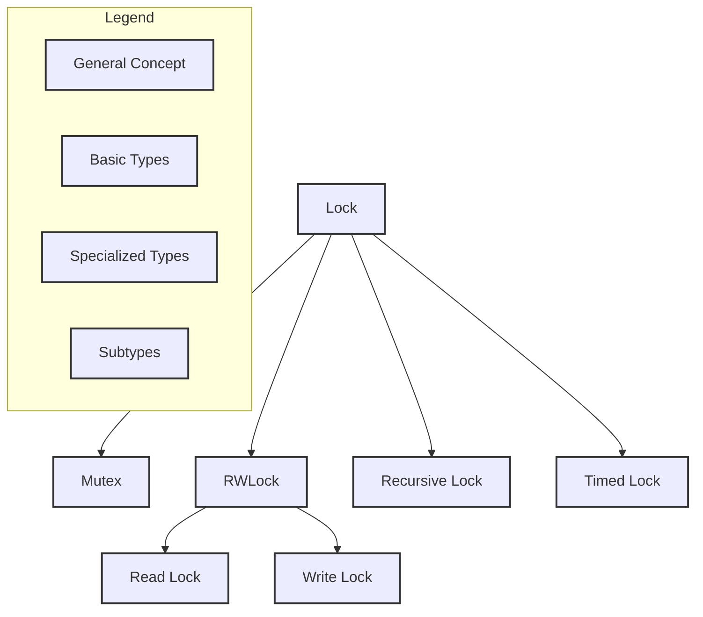
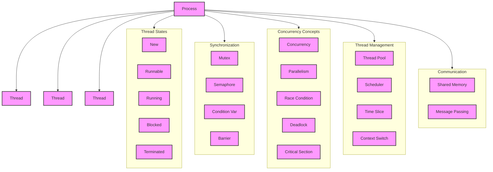
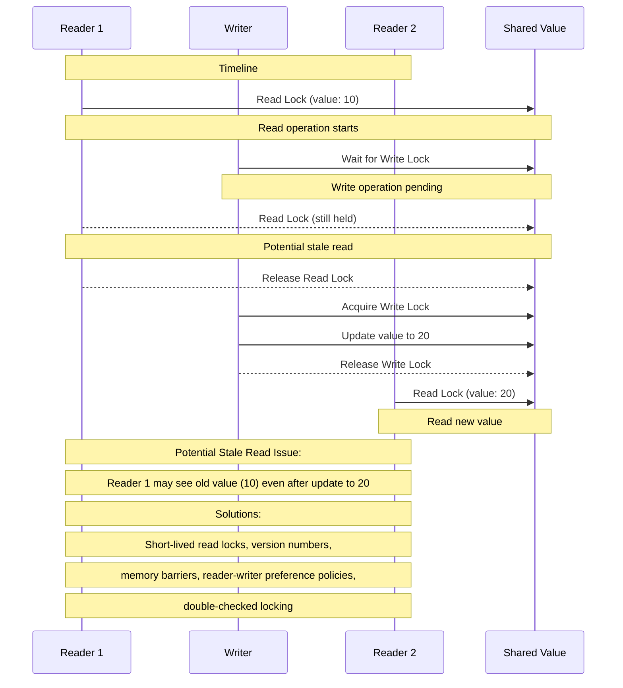

# Primer on Synchronization Mechanisms

## What are mutexes and locks?

1. Basic Concepts:

   a) Mutex (Mutual Exclusion):

   - A mechanism that prevents multiple threads from simultaneously accessing a shared resource.
   - Provides exclusive access to one thread at a time.

   b) Lock:

   - A general term for a synchronization mechanism that controls access to a shared resource.
   - Mutexes are a type of lock.

2. Types of Locks:

   a) Simple Lock (Mutex):

   - Allows only one thread to access the protected resource at a time.
   - Other threads must wait until the lock is released.

   b) Read-Write Lock (RWLock):

   - Allows concurrent read access but exclusive write access.
   - Multiple threads can read simultaneously, but writing requires exclusive access.

   c) Read Lock:

   - Part of an RWLock that allows shared read access.
   - Multiple threads can acquire read locks simultaneously.

   d) Write Lock:

   - Part of an RWLock that provides exclusive write access.
   - Only one thread can acquire a write lock, and no read locks can be held simultaneously.

3. Characteristics:

   a) Simple Lock (Mutex):

   - Use when: You need to protect a resource from concurrent access in all cases.
   - Pros: Simple to understand and use.
   - Cons: Can be less efficient when many read operations occur.

   b) Read-Write Lock (RWLock):

   - Use when: You have a resource that is frequently read but infrequently modified.
   - Pros: Allows for higher concurrency in read-heavy scenarios.
   - Cons: More complex to implement and use correctly.

4. Common Operations:

   a) Lock Acquisition:

   - For mutexes: lock() or acquire()
   - For RWLocks: read_lock() and write_lock()

   b) Lock Release:

   - For mutexes: unlock() or release()
   - For RWLocks: read_unlock() and write_unlock()

   c) Try Lock:

   - Attempt to acquire the lock without blocking: try_lock()
   - For RWLocks: try_read_lock() and try_write_lock()

5. Advanced Concepts:

   a) Recursive Locks:

   - Allow the same thread to acquire the lock multiple times without deadlocking.

   b) Timed Locks:

   - Attempt to acquire the lock with a timeout: try_lock_for() or try_lock_until()

   c) Shared Mutex:

   - Similar to RWLock but may have different performance characteristics or additional features in some implementations.

Now, let's visualize these concepts:

This diagram illustrates the relationships between different types of locks and their conceptual hierarchy.

To effectively navigate a typical mutex/thread synchronization library:

1. Understand your use case:

   - Is it read-heavy or write-heavy?
   - Do you need simple exclusion or more fine-grained control?

2. Choose the appropriate lock type:

   - For simple exclusion: use a basic mutex
   - For read-heavy scenarios with occasional writes: consider RWLock

3. Be aware of potential pitfalls:

   - Deadlocks: Always acquire locks in the same order across threads
   - Priority inversion: Some systems provide priority inheritance to mitigate this

4. Consider performance implications:

   - Lock contention can significantly impact performance
   - Use fine-grained locking where possible (lock smaller critical sections)

5. Explore advanced features if needed:

   - Timed locks for avoiding indefinite waits
   - Recursive locks for scenarios where a thread might need to acquire the same lock multiple times

6. Use higher-level abstractions when available:
   - Many languages provide constructs like `synchronized` blocks or `lock` guards that simplify correct usage

## Processes, threads and synchronization

1. Process:

   - A program in execution
   - Has its own memory space (heap, stack, data section)
   - Contains one or more threads
   - Managed by the operating system

2. Thread:

   - The smallest unit of execution within a process
   - Shares the process's resources (memory and files)
   - Has its own:
     - Stack
     - Register set
     - Program counter
   - Allows for concurrent execution within a single process

3. Core Concepts:

   a) Concurrency:

   - The ability to handle multiple tasks simultaneously
   - Doesn't necessarily mean parallel execution

   b) Parallelism:

   - Actual simultaneous execution of multiple tasks
   - Requires multiple CPU cores

   c) Context Switch:

   - The process of storing and restoring the state of a CPU so that execution can be resumed from the same point later

4. Thread States:

   - New: Thread is being created
   - Runnable: Thread is ready for execution
   - Running: Thread is currently executing
   - Blocked/Waiting: Thread is waiting for a resource or event
   - Terminated: Thread has completed execution

5. Thread-related Concepts:

   a) Thread Pool:

   - A collection of pre-initialized, reusable threads
   - Reduces the overhead of thread creation and destruction

   b) Scheduler:

   - Part of the operating system that decides which thread runs when

   c) Time Slice:

   - The amount of time a thread is allowed to run before the scheduler may switch to another thread

   d) Race Condition:

   - A situation where the outcome depends on the relative timing of events

   e) Deadlock:

   - A situation where two or more threads are unable to proceed because each is waiting for the other to release a resource

   f) Critical Section:

   - A part of the program where shared resources are accessed

6. Thread Synchronization Mechanisms:

   a) Mutex: (as discussed earlier)

   b) Semaphore:

   - A synchronization primitive that can allow multiple threads to access a resource, up to a set limit

   c) Condition Variable:

   - Allows threads to synchronize based on the actual value of data

   d) Barrier:

   - A synchronization primitive that blocks a group of threads until a certain number of threads have reached the barrier

7. Thread Communication:

   a) Shared Memory:

   - Threads within a process can communicate by reading and writing to the same memory locations

   b) Message Passing:

   - Threads can communicate by sending messages to each other

Now, let's visualize these concepts:

## What's to stop a stale read, in the case of read-write lock?

The short answer is: Nothing inherently prevents a reading thread from accessing an outdated pre-write value. This is a common concurrency issue known as a "read-write race condition" or "stale read."

Key points to understand:

1. Basic RWLock Behavior:

   - RWLocks allow multiple concurrent reads or a single exclusive write.
   - They don't automatically manage the freshness of data.

2. Potential Issues:

   - Reader-Writer Overlap: A reader might hold a lock while a writer is waiting, leading to stale reads.
   - Writer Starvation: Continuous reads might prevent a writer from acquiring the lock.

3. Causes of Stale Reads:

   - Long-held read locks
   - Improper lock acquisition order
   - Lack of proper synchronization between read and write operations

4. Solutions and Best Practices:

   a) Proper Lock Usage:

   - Acquire read locks for the shortest time possible.
   - Use write locks for any operation that modifies shared data.

   b) Memory Barriers / Fences:

   - Ensure visibility of changes across threads.
   - Often implicitly provided by lock/unlock operations in high-level languages.

   c) Version Numbers or Timestamps:

   - Maintain a version number or timestamp for the data.
   - Readers check if the version has changed and re-read if necessary.

   d) Reader-Writer Preference Policies:

   - Writer preference: Prevents new readers while a writer is waiting.
   - Reader preference: Allows readers to proceed unless a write lock is held.
   - Fair policy: First-come, first-served for both readers and writers.

   e) Double-Checked Locking Pattern:

   - Check a condition without a lock, then acquire the lock and check again.
   - Useful for read-heavy scenarios with infrequent updates.

   f) Use of Atomic Operations:

   - For simple data types, atomic operations can provide thread-safe reads and writes without locks.

Let's visualize these concepts with a diagram:

This diagram illustrates a scenario where a stale read can occur:

1. Reader 1 acquires a read lock and reads the value (10).
2. A writer comes in, waits for Reader 1 to release the lock, then writes a new value (20).
3. Reader 2 acquires a read lock and sees the new value (20).
4. However, if Reader 1's lock is long-lived, it may continue to see the old value (10) even after the write operation.

To prevent such issues:

1. Use short-lived read locks: Release read locks as soon as possible.
2. Implement version checking: Have readers verify if data has changed since they acquired the lock.
3. Use appropriate RWLock policies: Choose a policy (writer preference, reader preference, or fair) based on your use case.
4. Consider using atomic operations or lock-free data structures for simple scenarios.
5. Employ memory barriers or fences to ensure visibility of changes across threads.
6. Use higher-level concurrency constructs (e.g., concurrent collections) that handle these issues internally.

Remember, the choice of solution depends on your specific use case, performance requirements, and the complexity you're willing to manage. In many high-level programming environments, the standard libraries or frameworks provide RWLock implementations that address these issues, but it's crucial to understand the underlying concepts to use them correctly.
