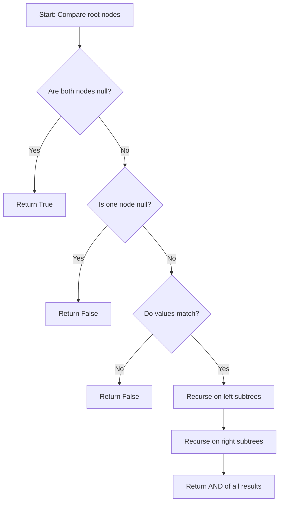

Thank you for providing the "Same Tree" problem from LeetCode. I'll provide different solutions, explain their complexities, and recommend the best approach to learn. Let's start with the problem setup and then dive into the solutions.

First, let's define the TreeNode class:

```python
from typing import Optional

class TreeNode:
    def __init__(self, val=0, left=None, right=None):
        self.val = val
        self.left = left
        self.right = right
```

Now, let's explore different solutions:

1. Recursive Solution

```python
class Solution:
    def isSameTree(self, p: Optional[TreeNode], q: Optional[TreeNode]) -> bool:
        # If both nodes are None, trees are identical
        if not p and not q:
            return True

        # If one node is None and the other isn't, trees are different
        if not p or not q:
            return False

        # Check if current nodes have same value and recursively check left and right subtrees
        return (p.val == q.val) and self.isSameTree(p.left, q.left) and self.isSameTree(p.right, q.right)
```

Time Complexity: O(min(n, m)), where n and m are the number of nodes in trees p and q respectively.
Space Complexity: O(min(h1, h2)) for the recursion stack, where h1 and h2 are the heights of the trees.

2. Iterative Solution using Queue

```python
from collections import deque

class Solution:
    def isSameTree(self, p: Optional[TreeNode], q: Optional[TreeNode]) -> bool:
        def check(n1, n2):
            # Helper function to check if two nodes are the same
            if not n1 and not n2:
                return True
            if not n1 or not n2:
                return False
            return n1.val == n2.val

        queue = deque([(p, q)])
        while queue:
            node1, node2 = queue.popleft()
            if not check(node1, node2):
                return False

            if node1:
                queue.append((node1.left, node2.left))
                queue.append((node1.right, node2.right))

        return True
```

Time Complexity: O(min(n, m)), where n and m are the number of nodes in trees p and q respectively.
Space Complexity: O(min(w1, w2)), where w1 and w2 are the maximum widths of the trees.

Recommendation:
I recommend learning the recursive solution first, as it's more intuitive and easier to understand. The recursive approach directly translates the problem statement into code, making it easier to grasp the concept. However, it's also important to understand the iterative solution, as it can be more efficient in terms of space complexity for very deep trees (to avoid stack overflow).

Let's create a simple visualization to help understand the recursive approach:



This diagram illustrates the decision-making process in the recursive approach. It shows how we first check if both nodes are null, then if one is null, then compare values, and finally recurse on left and right subtrees.

Now, let's provide some test cases:

```python
def test_same_tree():
    solution = Solution()

    # Test case 1: Same trees
    tree1 = TreeNode(1, TreeNode(2), TreeNode(3))
    tree2 = TreeNode(1, TreeNode(2), TreeNode(3))
    assert solution.isSameTree(tree1, tree2) == True

    # Test case 2: Different structures
    tree3 = TreeNode(1, TreeNode(2))
    tree4 = TreeNode(1, None, TreeNode(2))
    assert solution.isSameTree(tree3, tree4) == False

    # Test case 3: Different values
    tree5 = TreeNode(1, TreeNode(2), TreeNode(1))
    tree6 = TreeNode(1, TreeNode(1), TreeNode(2))
    assert solution.isSameTree(tree5, tree6) == False

    # Test case 4: Empty trees
    assert solution.isSameTree(None, None) == True

    # Test case 5: One empty, one non-empty
    tree7 = TreeNode(1)
    assert solution.isSameTree(tree7, None) == False

    print("All test cases passed!")

test_same_tree()
```

These test cases cover various scenarios including identical trees, trees with different structures, trees with different values, empty trees, and comparing an empty tree with a non-empty tree.

In conclusion, the recursive solution is recommended for its simplicity and intuitive nature. However, it's valuable to understand both recursive and iterative approaches, as they each have their strengths in different scenarios.
