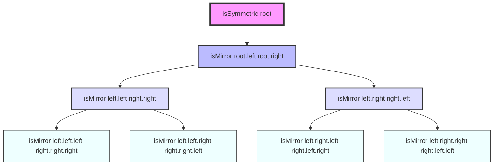

# Explanation: Symmetric Tree

## Analysis of problem & input data

This problem is about determining whether a binary tree is symmetric around its center, which means it's a mirror image of itself. Here are the key aspects to consider:

1. Tree structure: We're dealing with a binary tree, where each node can have up to two children.
2. Symmetry definition: For a tree to be symmetric, the left subtree should be a mirror image of the right subtree.
3. Mirror image: Two subtrees are mirror images if:
   - Their root values are the same
   - The left subtree of one is a mirror of the right subtree of the other, and vice versa
4. Input constraints:
   - The number of nodes is between 1 and 1000
   - Node values are integers between -100 and 100
5. Special cases:
   - An empty tree is considered symmetric
   - A tree with only a root node is symmetric

The key principle that makes this question relatively simple is the recursive nature of the problem. If we can determine whether two subtrees are mirrors of each other, we can apply this check recursively to solve the entire problem.

## Solutions

### Solution 1: Recursive Approach

```python
from typing import Optional

class TreeNode:
    def __init__(self, val=0, left=None, right=None):
        self.val = val
        self.left = left
        self.right = right

class Solution:
    def isSymmetric(self, root: Optional[TreeNode]) -> bool:
        def isMirror(left: Optional[TreeNode], right: Optional[TreeNode]) -> bool:
            # If both nodes are None, they're symmetric
            if not left and not right:
                return True

            # If one node is None and the other isn't, they're not symmetric
            if not left or not right:
                return False

            # Check if the values are equal and their subtrees are mirrors
            return (left.val == right.val and
                    isMirror(left.left, right.right) and
                    isMirror(left.right, right.left))

        # Start the recursion from the root's left and right children
        return isMirror(root.left, root.right) if root else True

```

This solution uses a recursive approach to check if the tree is symmetric. Here's the breakdown:

- Time Complexity: O(n), where n is the number of nodes in the tree. We visit each node once.
- Space Complexity: O(h) in the best case (balanced tree) and O(n) in the worst case (skewed tree), where h is the height of the tree. This space is used by the recursive call stack.

Intuitions and invariants:

- A tree is symmetric if its left and right subtrees are mirror images of each other.
- Two subtrees are mirror images if their root values are the same and their respective left and right subtrees are mirror images.
- The base case is when both nodes are None (symmetric) or one is None and the other isn't (not symmetric).

### Solution 2: Iterative Approach using Queue

```python
from typing import Optional
from collections import deque

class TreeNode:
    def __init__(self, val=0, left=None, right=None):
        self.val = val
        self.left = left
        self.right = right

class Solution:
    def isSymmetric(self, root: Optional[TreeNode]) -> bool:
        if not root:
            return True

        queue = deque([(root.left, root.right)])

        while queue:
            left, right = queue.popleft()

            # If both are None, continue to next pair
            if not left and not right:
                continue

            # If one is None and the other isn't, or values don't match
            if not left or not right or left.val != right.val:
                return False

            # Add the outer pair
            queue.append((left.left, right.right))
            # Add the inner pair
            queue.append((left.right, right.left))

        return True
```

This solution uses an iterative approach with a queue to check if the tree is symmetric. Here's the breakdown:

- Time Complexity: O(n), where n is the number of nodes in the tree. We visit each node once.
- Space Complexity: O(w), where w is the maximum width of the tree. In the worst case, this could be O(n/2) for a complete binary tree at the lowest level.

Intuitions and invariants:

- We can use a queue to perform a level-order traversal, comparing pairs of nodes.
- At each step, we compare the values of the current pair and enqueue their children in a mirrored order.
- If at any point we find a mismatch or one node is None while the other isn't, the tree is not symmetric.

## Recommendation

I recommend learning and mastering the recursive solution (Solution 1) for this problem. Here's why:

1. Intuitive: The recursive solution directly translates the problem's definition into code, making it easier to understand and remember.
2. Concise: It requires less code and is more elegant.
3. Generalizable: The concept of comparing two trees for symmetry can be applied to other tree-related problems.
4. Interview-friendly: It's easier to write on a whiteboard and explain during an interview.

However, it's also valuable to understand the iterative solution, as it demonstrates how to solve tree problems without recursion, which can be useful in scenarios where stack space is limited.

## Test cases

Here are some test cases to consider:

1. Empty tree:

   ```python
   assert Solution().isSymmetric(None) == True
   ```

2. Single node tree:

   ```python
   assert Solution().isSymmetric(TreeNode(1)) == True
   ```

3. Symmetric tree (Example 1):

   ```python
   root = TreeNode(1)
   root.left = TreeNode(2)
   root.right = TreeNode(2)
   root.left.left = TreeNode(3)
   root.left.right = TreeNode(4)
   root.right.left = TreeNode(4)
   root.right.right = TreeNode(3)
   assert Solution().isSymmetric(root) == True
   ```

4. Non-symmetric tree (Example 2):

   ```python
   root = TreeNode(1)
   root.left = TreeNode(2)
   root.right = TreeNode(2)
   root.left.right = TreeNode(3)
   root.right.right = TreeNode(3)
   assert Solution().isSymmetric(root) == False
   ```

5. Tree with negative values:

   ```python
   root = TreeNode(1)
   root.left = TreeNode(-2)
   root.right = TreeNode(-2)
   root.left.left = TreeNode(3)
   root.right.right = TreeNode(3)
   assert Solution().isSymmetric(root) == True
   ```

## Overview of rejected approaches

1. Comparing inorder traversals:
   One might think that if the inorder traversal of the left subtree is the reverse of the right subtree, the tree is symmetric. However, this approach fails for trees like [1,2,2,2,null,2], which would have the same inorder traversal for both subtrees ([2,2,2]) but is not symmetric.

2. Comparing level-order traversals:
   Similarly, comparing level-order traversals of left and right subtrees doesn't work because it doesn't capture the structural symmetry. For example, [1,2,2,3,4,4,3] and [1,2,2,4,3,3,4] would have the same level-order traversals but different structures.

3. Using a single recursive function without pairs:
   While it's possible to use a single recursive function that traverses the entire tree, it's more complex and less intuitive than comparing pairs of nodes. It would require keeping track of the current level and position, making the solution harder to understand and implement correctly.

These approaches are rejected because they either fail to capture the full structural symmetry of the tree or unnecessarily complicate the solution.

## Visualization(s)

To visualize the recursive solution, we can create a simple diagram showing how the function calls are made:



This diagram shows how the `isMirror` function is called recursively, comparing pairs of nodes from the left and right subtrees. The process continues until we reach leaf nodes or find a mismatch.
