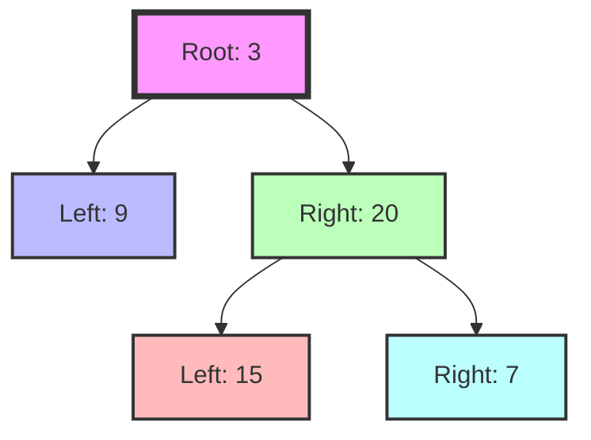

## Explanation: Construct Binary Tree from Preorder and Inorder Traversal

### Analysis of problem & input data

This problem is a classic example of binary tree reconstruction, which leverages the properties of different tree traversal methods to uniquely identify and reconstruct a binary tree. The key aspects to consider are:

1. **Traversal Properties:**

   - Preorder traversal: [root, left subtree, right subtree]
   - Inorder traversal: [left subtree, root, right subtree]

2. **Unique Values:** The problem states that all values are unique, which is crucial for the reconstruction process.

3. **Guaranteed Validity:** The input is guaranteed to be valid preorder and inorder traversals of the same tree, eliminating the need for extensive error checking.

4. **Array Lengths:** The lengths of both arrays are equal and represent the total number of nodes in the tree.

The key principle that makes this question solvable is the complementary nature of preorder and inorder traversals:

- The first element in the preorder array is always the root of the current (sub)tree.
- In the inorder array, elements to the left of the root belong to the left subtree, and elements to the right belong to the right subtree.

This problem is about pattern-matching to the "divide and conquer" strategy, specifically recursive tree construction. The solution leverages the properties of tree traversals to recursively build the tree from top to bottom.

### Test cases

1. **Basic case:**

   - Input: preorder = [3,9,20,15,7], inorder = [9,3,15,20,7]
   - Expected Output: [3,9,20,null,null,15,7]

2. **Single node tree:**

   - Input: preorder = [-1], inorder = [-1]
   - Expected Output: [-1]

3. **Left-skewed tree:**

   - Input: preorder = [1,2,3,4], inorder = [4,3,2,1]
   - Expected Output: [1,2,null,3,null,4]

4. **Right-skewed tree:**

   - Input: preorder = [1,2,3,4], inorder = [1,2,3,4]
   - Expected Output: [1,null,2,null,3,null,4]

5. **Balanced tree:**
   - Input: preorder = [1,2,4,5,3,6,7], inorder = [4,2,5,1,6,3,7]
   - Expected Output: [1,2,3,4,5,6,7]

Here's the Python code for these test cases:

```python
class TreeNode:
    def __init__(self, val=0, left=None, right=None):
        self.val = val
        self.left = left
        self.right = right

def buildTree(preorder: List[int], inorder: List[int]) -> Optional[TreeNode]:
    # Implementation goes here
    pass

# Test cases
test_cases = [
    ([3,9,20,15,7], [9,3,15,20,7]),
    ([-1], [-1]),
    ([1,2,3,4], [4,3,2,1]),
    ([1,2,3,4], [1,2,3,4]),
    ([1,2,4,5,3,6,7], [4,2,5,1,6,3,7])
]

for i, (preorder, inorder) in enumerate(test_cases):
    result = buildTree(preorder, inorder)
    print(f"Test case {i+1}: preorder = {preorder}, inorder = {inorder}")
    # Note: You would need to implement a function to convert the tree back to a list representation for verification
```

### Solutions

#### Overview of solution approaches

##### Solutions worth learning

1. Recursive approach with index mapping
2. Iterative approach using stack
3. Morris traversal (advanced)

Total count: 3 solutions

##### Rejected solutions

1. Brute force approach (trying all possible tree structures)
2. Dynamic programming approach (not suitable due to the recursive nature of the problem)

#### Worthy Solutions

##### Recursive approach with index mapping

```python
from typing import List, Optional

class TreeNode:
    def __init__(self, val=0, left=None, right=None):
        self.val = val
        self.left = left
        self.right = right

class Solution:
    def buildTree(self, preorder: List[int], inorder: List[int]) -> Optional[TreeNode]:
        # Create a hash map for quick index lookup in inorder array
        inorder_map = {val: idx for idx, val in enumerate(inorder)}

        def build(pre_start: int, pre_end: int, in_start: int, in_end: int) -> Optional[TreeNode]:
            if pre_start > pre_end:
                return None

            # The first element in preorder is always the root of the current subtree
            root_val = preorder[pre_start]
            root = TreeNode(root_val)

            # Find the index of root value in inorder array
            inorder_root_index = inorder_map[root_val]

            # Calculate the size of left subtree
            left_subtree_size = inorder_root_index - in_start

            # Recursively build left and right subtrees
            root.left = build(pre_start + 1, pre_start + left_subtree_size,
                              in_start, inorder_root_index - 1)
            root.right = build(pre_start + left_subtree_size + 1, pre_end,
                               inorder_root_index + 1, in_end)

            return root

        return build(0, len(preorder) - 1, 0, len(inorder) - 1)
```

Time Complexity: O(n), where n is the number of nodes in the tree.
Space Complexity: O(n) for the hash map and the recursion stack in the worst case of a skewed tree.

Key intuitions and invariants:

- The first element in preorder is always the root of the current subtree.
- The elements to the left of the root in inorder form the left subtree, and those to the right form the right subtree.
- Using a hash map for inorder indices allows O(1) lookup, crucial for efficiency.
- The size of the left subtree in preorder is the same as in inorder, allowing us to divide the problem correctly.

##### Iterative approach using stack (Detailed Explanation)

```python
from typing import List, Optional

class TreeNode:
    def __init__(self, val=0, left=None, right=None):
        self.val = val
        self.left = left
        self.right = right

class Solution:
    def buildTree(self, preorder: List[int], inorder: List[int]) -> Optional[TreeNode]:
        if not preorder or not inorder:
            return None

        root = TreeNode(preorder[0])
        stack = [root]
        inorder_index = 0

        for i in range(1, len(preorder)):
            current = TreeNode(preorder[i])
            parent = None

            # Pop nodes from stack while we're processing right children
            while stack and stack[-1].val == inorder[inorder_index]:
                parent = stack.pop()
                inorder_index += 1

            # Decide whether to attach as left or right child
            if parent:
                parent.right = current
            else:
                stack[-1].left = current

            stack.append(current)

        return root
```

Time Complexity: O(n), where n is the number of nodes in the tree.
Space Complexity: O(h), where h is the height of the tree. In the worst case of a skewed tree, this becomes O(n).

Detailed Explanation:

1. **Initialization:**

   - We start by creating the root node from the first element of the preorder array.
   - We initialize a stack with this root node.
   - We keep an `inorder_index` to track our position in the inorder array.

2. **Main Loop:**

   - We iterate through the preorder array starting from the second element (index 1).
   - For each value, we create a new `TreeNode`.

3. **Finding the Correct Parent:**

   - We compare the top of our stack with the current inorder value.
   - If they match, it means we've completed a left subtree and need to move up.
   - We pop nodes from the stack until we find a mismatch or the stack is empty.
   - The last popped node becomes the potential parent for attaching a right child.

4. **Attaching the New Node:**

   - If we found a parent in step 3, we attach the new node as its right child.
   - If we didn't find a parent, we attach the new node as the left child of the last node in our stack.

5. **Preparing for Next Iteration:**
   - We push the newly created node onto the stack.
   - This node might become a parent in future iterations.

Key Intuitions:

- The preorder traversal gives us the order in which to process nodes.
- The inorder traversal helps us determine when to move from left subtrees to right subtrees.
- The stack mimics the path from the root to the current node we're processing.
- When we pop nodes from the stack, we're moving up the tree to find the correct position for right children.

Let's visualize this process using the example:
preorder = [3, 9, 20, 15, 7]
inorder = [9, 3, 15, 20, 7]

```
Step 1: Create root (3)
Stack: [3]
Tree:  3

Step 2: Process 9
Stack: [3, 9]
Tree:  3
      /
     9

Step 3: Process 20 (mismatch with inorder, pop 9 and 3)
Stack: [20]
Tree:  3
      / \
     9  20

Step 4: Process 15
Stack: [20, 15]
Tree:  3
      / \
     9  20
        /
       15

Step 5: Process 7 (mismatch with inorder, pop 15)
Stack: [20, 7]
Tree:  3
      / \
     9  20
        / \
       15  7

Final Tree:
    3
   / \
  9  20
     / \
    15  7
```

Detailed Step-by-Step Breakdown:

1. Start with 3 (root)

   - Create node 3
   - Push 3 to stack
   - Stack: [3]

2. Process 9

   - Create node 9
   - Stack top (3) != inorder[0] (9), so attach 9 as left child of 3
   - Push 9 to stack
   - Stack: [3, 9]

3. Process 20

   - Create node 20
   - Stack top (9) == inorder[0] (9), pop 9
   - New stack top (3) == inorder[1] (3), pop 3
   - No more stack, so attach 20 as right child of last popped node (3)
   - Push 20 to stack
   - Stack: [20]

4. Process 15

   - Create node 15
   - Stack top (20) != inorder[2] (15), so attach 15 as left child of 20
   - Push 15 to stack
   - Stack: [20, 15]

5. Process 7
   - Create node 7
   - Stack top (15) == inorder[2] (15), pop 15
   - New stack top (20) != inorder[3] (20), so attach 7 as right child of 20
   - Push 7 to stack
   - Stack: [20, 7]

This approach essentially uses the stack to keep track of the path from the root to the current node we're processing. The inorder array helps us determine when we've completed processing a left subtree and need to move to a right subtree. By comparing the top of the stack with the current inorder value, we can determine whether to attach new nodes as left children or backtrack and attach them as right children.

##### Morris traversal (advanced)

```python
from typing import List, Optional

class TreeNode:
    def __init__(self, val=0, left=None, right=None):
        self.val = val
        self.left = left
        self.right = right

class Solution:
    def buildTree(self, preorder: List[int], inorder: List[int]) -> Optional[TreeNode]:
        if not preorder or not inorder:
            return None

        root = TreeNode(preorder[0])
        current = root
        stack = []
        pre_index, in_index = 1, 0

        while pre_index < len(preorder):
            if current.val == inorder[in_index]:
                while stack and stack[-1].val == inorder[in_index]:
                    current = stack.pop()
                    in_index += 1
                current = current.right = TreeNode(preorder[pre_index])
                pre_index += 1
            else:
                stack.append(current)
                current = current.left = TreeNode(preorder[pre_index])
                pre_index += 1

        return root
```

Time Complexity: O(n), where n is the number of nodes in the tree.
Space Complexity: O(h), where h is the height of the tree. In the best case (balanced tree), it's O(log n), and in the worst case (skewed tree), it's O(n).

Key intuitions and invariants:

- We build the tree using only one traversal of the preorder array.
- The stack keeps track of right child candidates as we build the left spine of the tree.
- When we find a match in inorder, we've completed a left subtree and need to backtrack to find the correct position for the right child.
- This approach combines ideas from the iterative solution with the efficiency of Morris traversal.

#### Rejected Approaches

1. **Brute Force Approach**: Generating all possible tree structures and checking if they match the given traversals. This would be extremely inefficient, with a time complexity of O(n!).

2. **Dynamic Programming Approach**: While DP is powerful for many tree problems, it's not suitable here due to the recursive nature of tree construction and the lack of overlapping subproblems.

#### Final Recommendations

The recursive approach with index mapping is the most intuitive and easiest to understand and implement in an interview setting. It clearly demonstrates understanding of tree traversals and recursive problem-solving. The time and space complexity are both O(n), which is optimal for this problem.

The iterative approach using a stack is also worth learning as it demonstrates how to solve tree problems iteratively, a skill often valued in interviews.

The Morris traversal approach, while interesting and space-efficient, might be too complex for most interview scenarios unless specifically asked for a constant space solution.

Therefore, I recommend focusing on mastering the recursive approach first, followed by the iterative approach if time permits.

### Visualization(s)

To visualize the recursive approach, let's consider the example:
preorder = [3,9,20,15,7], inorder = [9,3,15,20,7]



This diagram shows the final reconstructed tree. The process would be:

1. Start with root 3 (first in preorder)
2. In inorder, everything left of 3 (just 9) goes to the left subtree
3. Everything right of 3 in inorder (15,20,7) goes to the right subtree
4. Repeat the process for each subtree recursively

This visualization helps understand how the algorithm uses both traversals to reconstruct the original tree structure.
