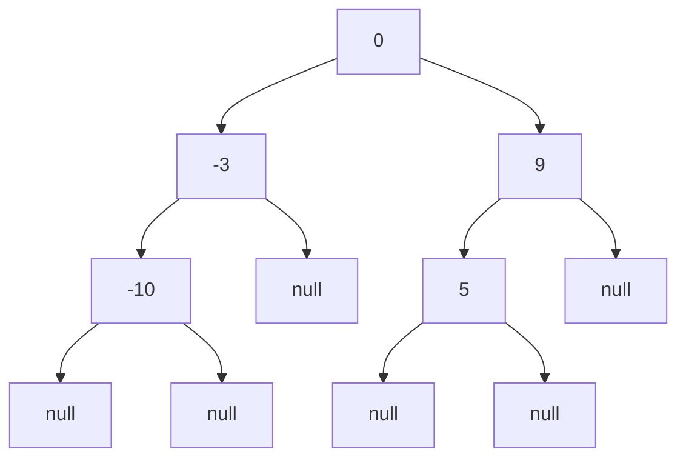

Certainly! Let's explore different solutions to convert a sorted array to a height-balanced binary search tree (BST). I'll provide Python implementations, explain their time and space complexities, and recommend the best approach.

Solution 1: Recursive Approach

This is the most intuitive and commonly used solution.

```python
from typing import List, Optional

class TreeNode:
    def __init__(self, val=0, left=None, right=None):
        self.val = val
        self.left = left
        self.right = right

class Solution:
    def sortedArrayToBST(self, nums: List[int]) -> Optional[TreeNode]:
        def helper(left: int, right: int) -> Optional[TreeNode]:
            if left > right:
                return None

            # Find the middle element
            mid = (left + right) // 2

            # Create the root node with the middle element
            root = TreeNode(nums[mid])

            # Recursively construct the left subtree
            root.left = helper(left, mid - 1)

            # Recursively construct the right subtree
            root.right = helper(mid + 1, right)

            return root

        return helper(0, len(nums) - 1)

# Test cases
solution = Solution()

# Test case 1
nums1 = [-10, -3, 0, 5, 9]
result1 = solution.sortedArrayToBST(nums1)

# Test case 2
nums2 = [1, 3]
result2 = solution.sortedArrayToBST(nums2)

```

Explanation:

1. We define a helper function that takes the left and right indices of the current subarray.
2. The base case is when left > right, which means we've processed all elements.
3. We find the middle element of the current subarray, which becomes the root of the current subtree.
4. We recursively construct the left and right subtrees.

Time Complexity: O(n), where n is the number of elements in the input array. We visit each element once to construct the BST.

Space Complexity: O(log n) for the balanced BST's height (recursion stack). The space used for the output tree is not counted in space complexity analysis.

Solution 2: Iterative Approach

While the recursive approach is more intuitive, we can also solve this problem iteratively using a queue.

```python
from typing import List, Optional
from collections import deque

class TreeNode:
    def __init__(self, val=0, left=None, right=None):
        self.val = val
        self.left = left
        self.right = right

class Solution:
    def sortedArrayToBST(self, nums: List[int]) -> Optional[TreeNode]:
        if not nums:
            return None

        root = TreeNode()
        queue = deque([(root, 0, len(nums) - 1)])

        while queue:
            node, left, right = queue.popleft()
            mid = (left + right) // 2
            node.val = nums[mid]

            if left <= mid - 1:
                node.left = TreeNode()
                queue.append((node.left, left, mid - 1))

            if mid + 1 <= right:
                node.right = TreeNode()
                queue.append((node.right, mid + 1, right))

        return root

# Test cases
solution = Solution()

# Test case 1
nums1 = [-10, -3, 0, 5, 9]
result1 = solution.sortedArrayToBST(nums1)

# Test case 2
nums2 = [1, 3]
result2 = solution.sortedArrayToBST(nums2)

```

Explanation:

1. We use a queue to keep track of nodes to process, along with their left and right indices.
2. We start with the root node and the entire array range.
3. For each node, we calculate the middle index and set the node's value.
4. If there are elements to the left of the middle, we create a left child and add it to the queue.
5. If there are elements to the right of the middle, we create a right child and add it to the queue.
6. We continue this process until the queue is empty.

Time Complexity: O(n), where n is the number of elements in the input array. We process each element once.

Space Complexity: O(log n) for the queue, which at most contains the nodes at one level of the BST.

Recommendation:
I would recommend learning and using the recursive solution (Solution 1) for the following reasons:

1. It's more intuitive and easier to understand.
2. It's more concise and requires less code.
3. Both solutions have the same time complexity, and the space complexity is also effectively the same (O(log n) for the recursion stack vs. O(log n) for the queue).
4. The recursive solution more closely mirrors the structure of the BST itself, making it easier to reason about and modify if needed.

However, it's valuable to understand both approaches, as the iterative solution can be useful in scenarios where you need to avoid recursion due to stack limitations or when working with very large datasets.

To help visualize the algorithm, let's create a simple diagram of how the BST is constructed for the input [-10, -3, 0, 5, 9].



This diagram shows how the BST is constructed from the sorted array [-10, -3, 0, 5, 9]:

1. The root is 0 (middle element).
2. The left subtree contains [-10, -3], with -3 as the root.
3. The right subtree contains [5, 9], with 9 as the root.
4. -10 becomes the left child of -3, and 5 becomes the left child of 9.

This visual representation helps to understand how the algorithm chooses the middle element at each step to maintain balance in the BST.

Lastly, here are some additional test cases to ensure the correctness of the implementation:

```python
# Additional test cases
nums3 = [1, 2, 3, 4, 5]
result3 = solution.sortedArrayToBST(nums3)

nums4 = [-5, -4, -3, -2, -1]
result4 = solution.sortedArrayToBST(nums4)

nums5 = [0]
result5 = solution.sortedArrayToBST(nums5)

nums6 = []
result6 = solution.sortedArrayToBST(nums6)
```

These test cases cover various scenarios:

- A sorted array of positive integers
- A sorted array of negative integers
- An array with a single element
- An empty array

You can run these test cases with either the recursive or iterative solution to verify that the implementation handles all these cases correctly.
