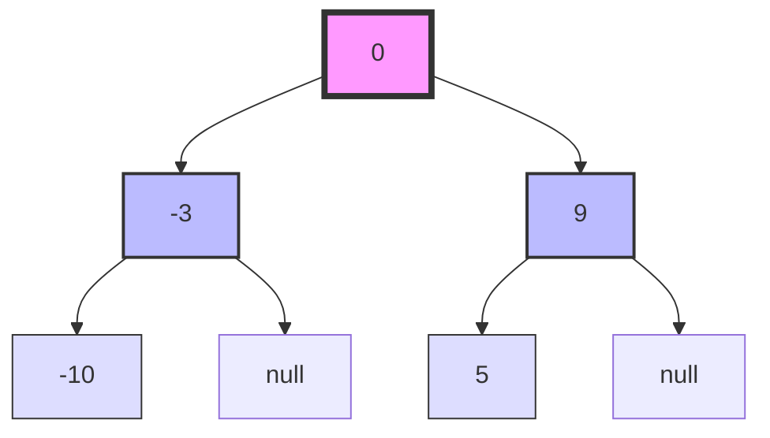

# Explanation: Convert Sorted Array to Binary Search Tree

## Analysis of problem & input data

This problem presents several key characteristics that guide us towards an efficient solution:

1. The input is a sorted array in ascending order.
2. We need to create a height-balanced binary search tree (BST).
3. The array elements are guaranteed to be in strictly increasing order.
4. The problem constraints suggest that we need to handle arrays of various sizes efficiently.

The critical insight here is the relationship between a sorted array and an in-order traversal of a BST. In a BST, an in-order traversal always yields elements in sorted order. Conversely, if we have a sorted array, we can construct a BST by choosing the middle element as the root, recursively constructing the left subtree from the elements before the middle, and the right subtree from the elements after the middle.

This approach naturally leads to a height-balanced tree because we're always choosing the middle element, ensuring that the left and right subtrees have an equal (or at most differing by one) number of nodes.

## Solutions

### Solution 1: Recursive Middle Element Approach

```python
from typing import List, Optional

class TreeNode:
    def __init__(self, val=0, left=None, right=None):
        self.val = val
        self.left = left
        self.right = right

class Solution:
    def sortedArrayToBST(self, nums: List[int]) -> Optional[TreeNode]:
        def helper(left: int, right: int) -> Optional[TreeNode]:
            if left > right:
                return None

            # Choose the middle element as the root
            mid = (left + right) // 2
            root = TreeNode(nums[mid])

            # Recursively construct left and right subtrees
            root.left = helper(left, mid - 1)
            root.right = helper(mid + 1, right)

            return root

        return helper(0, len(nums) - 1)
```

This solution leverages the following intuitions and invariants:

- The middle element of a sorted array is the ideal root for a balanced BST.
- Recursively applying this principle to subarrays naturally balances the tree.
- The left subtree contains all elements smaller than the root, and the right subtree contains all larger elements, maintaining the BST property.

Time Complexity: O(n), where n is the number of elements in the array. We visit each element once to construct the tree.
Space Complexity: O(log n) for the recursive call stack in a balanced tree, which is the height of the tree.

## Recommendation

The recursive middle element approach is the recommended solution for this problem. It's intuitive, efficient, and directly translates the problem's characteristics into a clean algorithm. This solution is both easy to understand and implement, making it an excellent choice for interviews and practical applications.

## Test cases

```python
def test_sortedArrayToBST():
    solution = Solution()

    # Test case 1: Basic case
    result = solution.sortedArrayToBST([-10,-3,0,5,9])
    assert is_valid_bst(result) and is_balanced(result)

    # Test case 2: Two elements
    result = solution.sortedArrayToBST([1,3])
    assert is_valid_bst(result) and is_balanced(result)

    # Test case 3: Single element
    result = solution.sortedArrayToBST([0])
    assert is_valid_bst(result) and is_balanced(result)

    # Test case 4: Large sorted array
    large_array = list(range(-10000, 10001, 2))  # -10000 to 10000, step 2
    result = solution.sortedArrayToBST(large_array)
    assert is_valid_bst(result) and is_balanced(result)

def is_valid_bst(root: Optional[TreeNode]) -> bool:
    def validate(node, low=float('-inf'), high=float('inf')):
        if not node:
            return True
        if node.val <= low or node.val >= high:
            return False
        return validate(node.left, low, node.val) and validate(node.right, node.val, high)
    return validate(root)

def is_balanced(root: Optional[TreeNode]) -> bool:
    def check_height(node):
        if not node:
            return 0
        left = check_height(node.left)
        right = check_height(node.right)
        if left == -1 or right == -1 or abs(left - right) > 1:
            return -1
        return max(left, right) + 1
    return check_height(root) != -1

# Run the tests
test_sortedArrayToBST()
print("All tests passed!")
```

These test cases cover various scenarios including the given examples, edge cases (single element), and a large input to ensure the solution scales well.

## Overview of rejected approaches

1. Naive BST Construction:
   Building the BST by inserting elements one by one from the sorted array might seem intuitive, but it would result in a skewed tree, not a height-balanced one. This approach is rejected because it fails to meet the height-balanced requirement and would have a time complexity of O(n^2) in the worst case.

2. Random Selection of Root:
   Randomly selecting elements as roots might eventually produce a balanced tree, but it's not guaranteed and would likely require multiple attempts. This approach is rejected due to its non-deterministic nature and potential inefficiency.

3. Heap-based Approach:
   While heaps can be used to create balanced trees, they don't preserve the BST property where all left subtree elements are smaller than the root and all right subtree elements are larger. This approach is rejected because it doesn't meet the BST requirement.

## Visualization(s)

To visualize how the algorithm works, let's create a simple diagram showing the process for the input `[-10, -3, 0, 5, 9]`:



This diagram illustrates:

1. The middle element (0) is chosen as the root.
2. The left subarray [-10, -3] creates the left subtree with -3 as its root.
3. The right subarray [5, 9] creates the right subtree with 9 as its root.
4. This process continues recursively for each subarray.

The resulting tree is both balanced and maintains the BST property, with each node's left subtree containing only smaller values and the right subtree containing only larger values.
