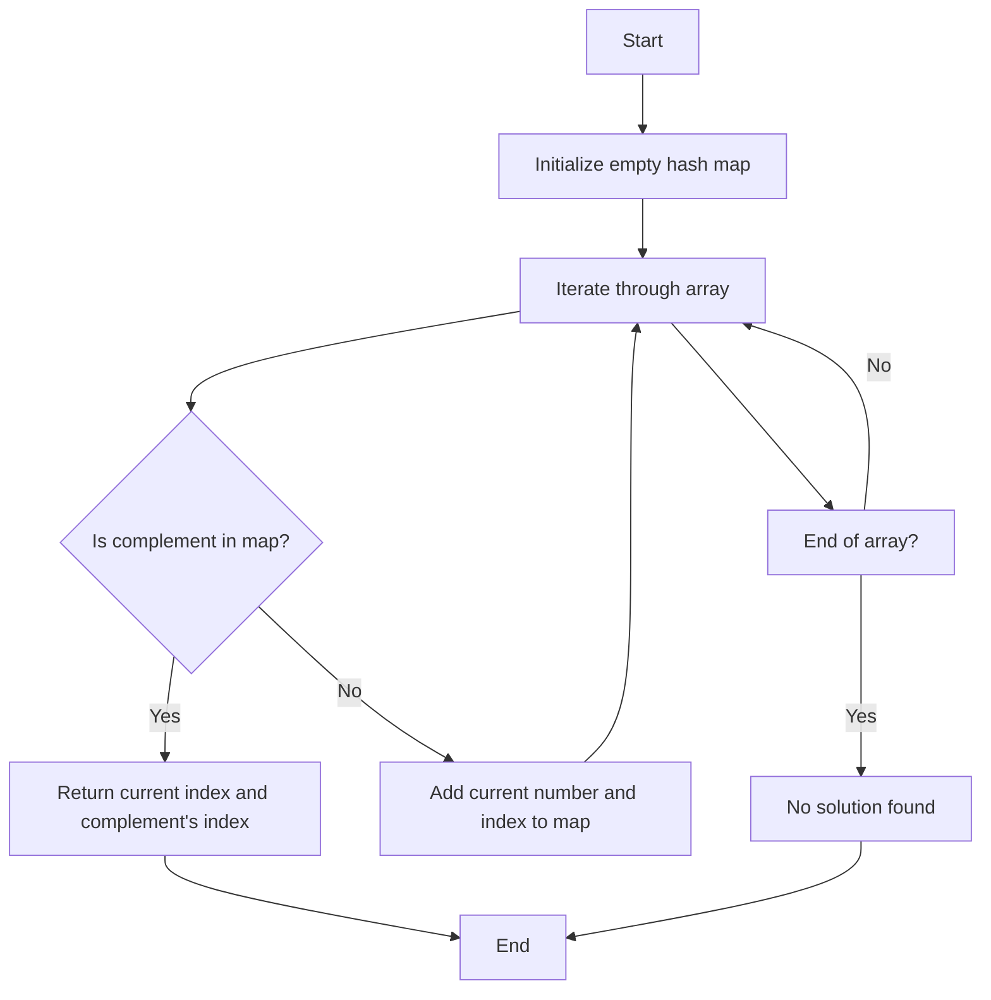

Certainly! I'll provide you with three different solutions for the Two Sum problem, explain their time and space complexities, and recommend the best one to learn. I'll use Python with type hints and helpful modules where appropriate.

Solution 1: Brute Force Approach

```python
from typing import List

def two_sum(nums: List[int], target: int) -> List[int]:
    n = len(nums)
    for i in range(n):  # Iterate through each element
        for j in range(i + 1, n):  # Compare with every other element
            if nums[i] + nums[j] == target:  # Check if the sum equals the target
                return [i, j]  # Return the indices if found
    return []  # Return empty list if no solution found (shouldn't happen given the problem constraints)

# Test cases
print(two_sum([2, 7, 11, 15], 9))  # Expected output: [0, 1]
print(two_sum([3, 2, 4], 6))  # Expected output: [1, 2]
print(two_sum([3, 3], 6))  # Expected output: [0, 1]

```

Time Complexity: O(n^2), where n is the length of the input list. We're using nested loops to compare each pair of numbers.
Space Complexity: O(1), as we're not using any extra space that scales with the input size.

Solution 2: Hash Table Approach

```python
from typing import List, Dict

def two_sum(nums: List[int], target: int) -> List[int]:
    num_map: Dict[int, int] = {}  # Create a dictionary to store number-index pairs
    for i, num in enumerate(nums):
        complement = target - num  # Calculate the complement
        if complement in num_map:  # Check if the complement exists in the map
            return [num_map[complement], i]  # Return the indices if found
        num_map[num] = i  # Add the current number and its index to the map
    return []  # Return empty list if no solution found (shouldn't happen given the problem constraints)

# Test cases
print(two_sum([2, 7, 11, 15], 9))  # Expected output: [0, 1]
print(two_sum([3, 2, 4], 6))  # Expected output: [1, 2]
print(two_sum([3, 3], 6))  # Expected output: [0, 1]

```

Time Complexity: O(n), where n is the length of the input list. We're iterating through the list once.
Space Complexity: O(n), as in the worst case, we might need to store almost all elements in the hash table.

Solution 3: Two-pointer Approach (only works for sorted arrays)

```python
from typing import List

def two_sum(nums: List[int], target: int) -> List[int]:
    # Note: This solution assumes the input array is sorted
    left, right = 0, len(nums) - 1  # Initialize two pointers
    while left < right:
        current_sum = nums[left] + nums[right]
        if current_sum == target:
            return [left, right]  # Return indices if sum is found
        elif current_sum < target:
            left += 1  # Move left pointer if sum is too small
        else:
            right -= 1  # Move right pointer if sum is too large
    return []  # Return empty list if no solution found (shouldn't happen given the problem constraints)

# Test cases (with sorted arrays)
print(two_sum([2, 7, 11, 15], 9))  # Expected output: [0, 1]
print(two_sum([2, 3, 4], 6))  # Expected output: [0, 2]
print(two_sum([3, 3], 6))  # Expected output: [0, 1]

```

Time Complexity: O(n), where n is the length of the input list. We're iterating through the list once.
Space Complexity: O(1), as we're only using two pointers regardless of the input size.

Recommendation:
The best solution to learn would be Solution 2: Hash Table Approach. Here's why:

1. Efficiency: It has a time complexity of O(n), which is optimal for this problem and meets the follow-up challenge of being less than O(n^2).
2. Versatility: Unlike the two-pointer approach, it doesn't require the input array to be sorted.
3. Space-time trade-off: While it uses O(n) space, it provides a significant speed improvement over the brute force method.
4. Real-world applicability: The hash table technique is widely used in many programming problems and is a valuable skill to master.

To help visualize the Hash Table approach, let's create a simple diagram:



This diagram illustrates the flow of the Hash Table approach, showing how we iterate through the array once, checking for the complement and adding elements to the hash map as we go.

Remember to practice implementing these solutions and understanding their trade-offs. The Hash Table approach is particularly important as it demonstrates how we can often optimize problems by trading some space for improved time complexity.
