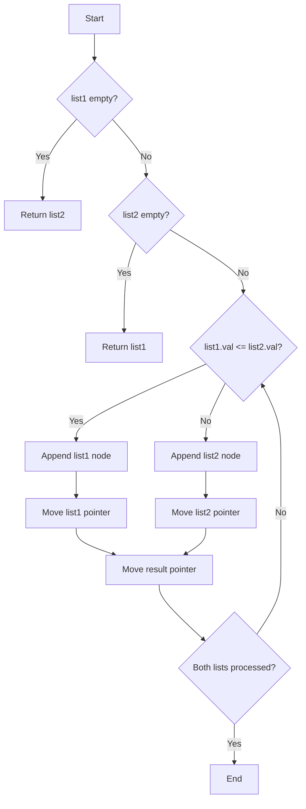

Certainly! Let's explore different solutions to merge two sorted linked lists, analyze their complexities, and visualize the algorithm. We'll start with the most straightforward solution and then look at an optimized version.

Solution 1: Iterative Approach

Let's begin with an iterative approach that creates a new linked list:

```python
from typing import Optional

class ListNode:
    def __init__(self, val=0, next=None):
        self.val = val
        self.next = next

def mergeTwoLists(list1: Optional[ListNode], list2: Optional[ListNode]) -> Optional[ListNode]:
    # Create a dummy node to simplify the merging process
    dummy = ListNode(0)
    current = dummy

    # Traverse both lists and compare nodes
    while list1 and list2:
        if list1.val <= list2.val:
            current.next = list1
            list1 = list1.next
        else:
            current.next = list2
            list2 = list2.next
        current = current.next

    # Append remaining nodes from either list
    if list1:
        current.next = list1
    if list2:
        current.next = list2

    # Return the head of the merged list (skip the dummy node)
    return dummy.next

# Test cases
def create_linked_list(values):
    dummy = ListNode(0)
    current = dummy
    for val in values:
        current.next = ListNode(val)
        current = current.next
    return dummy.next

def print_linked_list(head):
    values = []
    while head:
        values.append(head.val)
        head = head.next
    print(values)

# Test case 1
list1 = create_linked_list([1, 2, 4])
list2 = create_linked_list([1, 3, 4])
result = mergeTwoLists(list1, list2)
print("Test case 1:")
print_linked_list(result)

# Test case 2
list1 = create_linked_list([])
list2 = create_linked_list([])
result = mergeTwoLists(list1, list2)
print("Test case 2:")
print_linked_list(result)

# Test case 3
list1 = create_linked_list([])
list2 = create_linked_list([0])
result = mergeTwoLists(list1, list2)
print("Test case 3:")
print_linked_list(result)

```

Explanation of the iterative solution:

1. We create a dummy node to simplify the merging process and avoid edge cases.
2. We use a `current` pointer to keep track of the last node in the merged list.
3. We iterate through both lists simultaneously, comparing the values of the nodes.
4. We append the node with the smaller value to the merged list and move the corresponding list pointer forward.
5. After the loop, we append any remaining nodes from either list.
6. Finally, we return the head of the merged list (skipping the dummy node).

Time Complexity: O(n + m), where n and m are the lengths of list1 and list2 respectively.
Space Complexity: O(1), as we only use a constant amount of extra space.

Solution 2: Recursive Approach

Now, let's look at a recursive solution:

```python
from typing import Optional

class ListNode:
    def __init__(self, val=0, next=None):
        self.val = val
        self.next = next

def mergeTwoLists(list1: Optional[ListNode], list2: Optional[ListNode]) -> Optional[ListNode]:
    # Base cases
    if not list1:
        return list2
    if not list2:
        return list1

    # Compare the values and recursively merge
    if list1.val <= list2.val:
        list1.next = mergeTwoLists(list1.next, list2)
        return list1
    else:
        list2.next = mergeTwoLists(list1, list2.next)
        return list2

# Test cases (reuse the create_linked_list and print_linked_list functions from the previous solution)

# Test case 1
list1 = create_linked_list([1, 2, 4])
list2 = create_linked_list([1, 3, 4])
result = mergeTwoLists(list1, list2)
print("Test case 1:")
print_linked_list(result)

# Test case 2
list1 = create_linked_list([])
list2 = create_linked_list([])
result = mergeTwoLists(list1, list2)
print("Test case 2:")
print_linked_list(result)

# Test case 3
list1 = create_linked_list([])
list2 = create_linked_list([0])
result = mergeTwoLists(list1, list2)
print("Test case 3:")
print_linked_list(result)

```

Explanation of the recursive solution:

1. We handle the base cases first: if either list is empty, we return the other list.
2. We compare the values of the current nodes in both lists.
3. We recursively merge the rest of the lists, attaching the result to the node with the smaller value.
4. We return the node with the smaller value, which becomes the head of the merged sublist.

Time Complexity: O(n + m), where n and m are the lengths of list1 and list2 respectively.
Space Complexity: O(n + m) due to the recursive call stack.

Recommendation:
For this problem, I recommend learning and using the iterative solution (Solution 1) for the following reasons:

1. It has better space complexity (O(1) vs O(n + m) for the recursive solution).
2. It's generally easier to understand and implement in an interview setting.
3. It avoids potential stack overflow issues for very large lists.

However, it's worth understanding both solutions, as the recursive approach demonstrates a different way of thinking about the problem and can be useful in other scenarios.

Visualization:
To help understand the merging process, let's create a simple visualization using Mermaid:



This flowchart visualizes the decision-making process in the iterative solution. It shows how we compare the values of the current nodes in both lists and append the smaller one to the result list, moving the pointers accordingly.

In conclusion, the iterative solution provides an efficient and space-optimized approach to merging two sorted linked lists. It's a fundamental algorithm that's important to understand for linked list manipulation and is commonly asked in coding interviews.
