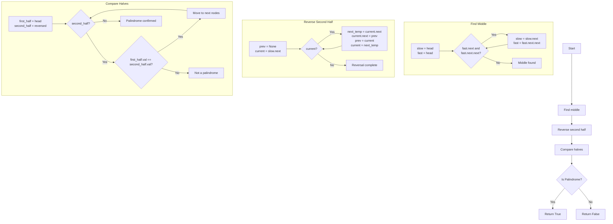

Certainly! Let's dive into the problem of determining if a singly linked list is a palindrome. I'll provide multiple solutions, explain their complexities, and recommend the best one to learn. We'll use Python with type hints and helpful modules where appropriate.

Let's start with the definition of the ListNode class:

```python
from typing import Optional

class ListNode:
    def __init__(self, val=0, next=None):
        self.val: int = val
        self.next: Optional[ListNode] = next
```

Now, let's explore different solutions:

1. Naive Solution (Using Extra Space)

```python
from typing import Optional, List

class Solution:
    def isPalindrome(self, head: Optional[ListNode]) -> bool:
        # Convert linked list to array
        values: List[int] = []
        current = head
        while current:
            values.append(current.val)
            current = current.next

        # Check if the array is a palindrome
        return values == values[::-1]
```

Explanation:

- Time Complexity: O(n), where n is the number of nodes in the linked list.
- Space Complexity: O(n), as we're using an additional array to store all values.

This solution is straightforward but uses extra space. It converts the linked list to an array and then checks if the array is a palindrome by comparing it with its reverse.

2. Two-Pointer Solution (Optimal)

```python
from typing import Optional

class Solution:
    def isPalindrome(self, head: Optional[ListNode]) -> bool:
        if not head or not head.next:
            return True

        # Find the middle of the linked list
        slow = fast = head
        while fast.next and fast.next.next:
            slow = slow.next
            fast = fast.next.next

        # Reverse the second half of the linked list
        second_half = self.reverseList(slow.next)

        # Compare the first half with the reversed second half
        first_half = head
        while second_half:
            if first_half.val != second_half.val:
                return False
            first_half = first_half.next
            second_half = second_half.next

        return True

    def reverseList(self, head: Optional[ListNode]) -> Optional[ListNode]:
        prev = None
        current = head
        while current:
            next_temp = current.next
            current.next = prev
            prev = current
            current = next_temp
        return prev
```

Explanation:

- Time Complexity: O(n), where n is the number of nodes in the linked list.
- Space Complexity: O(1), as we're using constant extra space.

This solution uses the two-pointer technique to find the middle of the linked list, reverses the second half, and then compares it with the first half. It's optimal in terms of both time and space complexity.

Recommendation:
I recommend learning and mastering the Two-Pointer Solution (Option 2) for the following reasons:

1. It satisfies the follow-up question of solving the problem in O(n) time and O(1) space.
2. It demonstrates important linked list techniques: finding the middle, reversing a linked list, and traversing two lists simultaneously.
3. It's a common pattern in many linked list problems, so understanding this solution will help with other similar problems.

Let's visualize this algorithm:



This visualization shows the main steps of the algorithm:

1. Finding the middle of the linked list
2. Reversing the second half
3. Comparing the two halves

Now, let's provide some test cases:

```python
def test_isPalindrome():
    # Test case 1: Palindrome with even number of elements
    head1 = ListNode(1, ListNode(2, ListNode(2, ListNode(1))))
    assert Solution().isPalindrome(head1) == True

    # Test case 2: Not a palindrome
    head2 = ListNode(1, ListNode(2))
    assert Solution().isPalindrome(head2) == False

    # Test case 3: Palindrome with odd number of elements
    head3 = ListNode(1, ListNode(2, ListNode(3, ListNode(2, ListNode(1)))))
    assert Solution().isPalindrome(head3) == True

    # Test case 4: Single element (always a palindrome)
    head4 = ListNode(1)
    assert Solution().isPalindrome(head4) == True

    # Test case 5: Empty list (considered a palindrome)
    head5 = None
    assert Solution().isPalindrome(head5) == True

    print("All test cases passed!")

test_isPalindrome()
```

These test cases cover various scenarios:

1. Even-length palindrome
2. Non-palindrome
3. Odd-length palindrome
4. Single-element list
5. Empty list

By understanding and implementing this solution, you'll have a strong grasp of an efficient approach to solving the palindrome linked list problem, which satisfies both the time and space complexity requirements.
