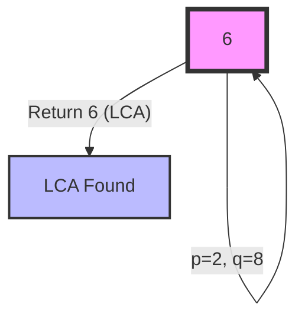
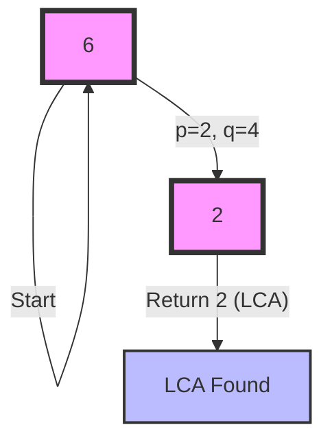

Thank you for providing the problem description. Let's dive into solving the Lowest Common Ancestor (LCA) problem for a Binary Search Tree (BST). I'll provide two different solutions, explain their time and space complexities, and recommend the best approach to learn.

Solution 1: Recursive Approach

Let's start with a recursive solution, which is intuitive and leverages the BST property.

```python
from typing import Optional

class TreeNode:
    def __init__(self, val=0, left=None, right=None):
        self.val = val
        self.left = left
        self.right = right

class Solution:
    def lowestCommonAncestor(self, root: 'TreeNode', p: 'TreeNode', q: 'TreeNode') -> 'TreeNode':
        # If both p and q are greater than the current node, LCA is in the right subtree
        if p.val > root.val and q.val > root.val:
            return self.lowestCommonAncestor(root.right, p, q)

        # If both p and q are less than the current node, LCA is in the left subtree
        elif p.val < root.val and q.val < root.val:
            return self.lowestCommonAncestor(root.left, p, q)

        # If one is greater and one is smaller (or one is equal), current node is the LCA
        else:
            return root

# Test cases
def test_lca():
    # Create the BST from Example 1
    root = TreeNode(6)
    root.left = TreeNode(2)
    root.right = TreeNode(8)
    root.left.left = TreeNode(0)
    root.left.right = TreeNode(4)
    root.right.left = TreeNode(7)
    root.right.right = TreeNode(9)
    root.left.right.left = TreeNode(3)
    root.left.right.right = TreeNode(5)

    solution = Solution()

    # Test case 1
    assert solution.lowestCommonAncestor(root, root.left, root.right).val == 6

    # Test case 2
    assert solution.lowestCommonAncestor(root, root.left, root.left.right).val == 2

    # Test case 3
    small_root = TreeNode(2)
    small_root.left = TreeNode(1)
    assert solution.lowestCommonAncestor(small_root, small_root, small_root.left).val == 2

    print("All test cases passed!")

test_lca()

```

Explanation:

1. This solution uses the BST property: all nodes in the left subtree are smaller than the current node, and all nodes in the right subtree are larger.
2. We compare the values of p and q with the current node's value.
3. If both p and q are greater than the current node, we know the LCA must be in the right subtree.
4. If both p and q are less than the current node, we know the LCA must be in the left subtree.
5. If one is greater and one is smaller (or one is equal to the current node), we've found the LCA.

Time Complexity: O(h), where h is the height of the tree. In the worst case (skewed tree), it could be O(n), where n is the number of nodes.
Space Complexity: O(h) for the recursive call stack.

Solution 2: Iterative Approach

Now, let's look at an iterative solution, which can be more efficient in terms of space complexity.

```python
from typing import Optional

class TreeNode:
    def __init__(self, val=0, left=None, right=None):
        self.val = val
        self.left = left
        self.right = right

class Solution:
    def lowestCommonAncestor(self, root: 'TreeNode', p: 'TreeNode', q: 'TreeNode') -> 'TreeNode':
        current = root

        while current:
            # If both p and q are greater than the current node, move to the right subtree
            if p.val > current.val and q.val > current.val:
                current = current.right

            # If both p and q are less than the current node, move to the left subtree
            elif p.val < current.val and q.val < current.val:
                current = current.left

            # If one is greater and one is smaller (or one is equal), current node is the LCA
            else:
                return current

# Test cases
def test_lca():
    # Create the BST from Example 1
    root = TreeNode(6)
    root.left = TreeNode(2)
    root.right = TreeNode(8)
    root.left.left = TreeNode(0)
    root.left.right = TreeNode(4)
    root.right.left = TreeNode(7)
    root.right.right = TreeNode(9)
    root.left.right.left = TreeNode(3)
    root.left.right.right = TreeNode(5)

    solution = Solution()

    # Test case 1
    assert solution.lowestCommonAncestor(root, root.left, root.right).val == 6

    # Test case 2
    assert solution.lowestCommonAncestor(root, root.left, root.left.right).val == 2

    # Test case 3
    small_root = TreeNode(2)
    small_root.left = TreeNode(1)
    assert solution.lowestCommonAncestor(small_root, small_root, small_root.left).val == 2

    print("All test cases passed!")

test_lca()

```

Explanation:

1. This solution uses the same logic as the recursive approach but implements it iteratively.
2. We start from the root and traverse down the tree.
3. At each step, we compare the values of p and q with the current node's value.
4. We move to the right subtree if both p and q are greater than the current node.
5. We move to the left subtree if both p and q are less than the current node.
6. If one is greater and one is smaller (or one is equal), we've found the LCA.

Time Complexity: O(h), where h is the height of the tree. In the worst case (skewed tree), it could be O(n), where n is the number of nodes.
Space Complexity: O(1), as we only use a constant amount of extra space.

Recommendation:
I recommend learning and mastering the iterative approach (Solution 2) for the following reasons:

1. It has a better space complexity (O(1) vs O(h) for the recursive approach).
2. It's generally faster in practice due to the lack of function call overhead.
3. It's easier to understand the step-by-step process of finding the LCA.
4. It's less prone to stack overflow errors for very deep trees.

However, it's valuable to understand both approaches, as the recursive solution can be more intuitive for some people and is a good exercise in recursive thinking.

Visualization:
To help understand the algorithm, let's create a simple visualization of how it works on the BST from Example 1.



This visualization shows the process for finding the LCA of nodes 2 and 8 in the given BST:

1. We start at the root (6).
2. We compare 2 and 8 with 6.
3. Since 2 < 6 < 8, we've found the LCA at the root.

For a more complex example, like finding the LCA of 2 and 4:



This visualization shows:

1. We start at the root (6).
2. Since both 2 and 4 are less than 6, we move to the left child (2).
3. At node 2, we find that 2 <= 2 <= 4, so we've found the LCA.

These visualizations help illustrate how the algorithm traverses the BST to find the LCA efficiently.
