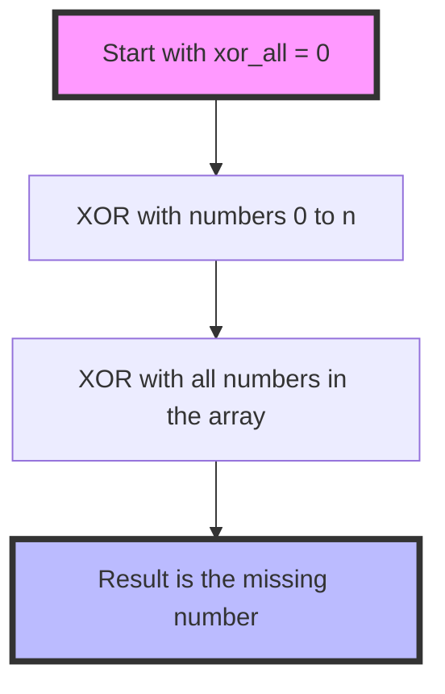

Certainly! Let's explore different solutions to the "Missing Number" problem, starting from the most straightforward approach and progressing to more optimized solutions. We'll analyze each solution's time and space complexity, and provide recommendations.

Solution 1: Sorting

Let's start with a simple sorting-based approach:

```python
from typing import List

def find_missing_number(nums: List[int]) -> int:
    n = len(nums)
    nums.sort()  # Sort the array in ascending order

    # Check if n is missing (if the last number is not n)
    if nums[-1] != n:
        return n

    # Check for missing number in the range [0, n-1]
    for i in range(n):
        if i != nums[i]:
            return i

    # If we reach here, it means no number is missing (shouldn't happen given the problem constraints)
    return -1  # or raise an exception

# Test cases
test_cases = [
    [3, 0, 1],
    [0, 1],
    [9, 6, 4, 2, 3, 5, 7, 0, 1],
    [0]
]

for case in test_cases:
    print(f"Input: {case}")
    print(f"Output: {find_missing_number(case)}\n")

```

Time Complexity: O(n log n) due to sorting
Space Complexity: O(1) if we're allowed to modify the input array, otherwise O(n) for creating a copy

This solution is simple to understand but not optimal in terms of time complexity due to sorting.

Solution 2: Using Set

We can optimize the time complexity using a set:

```python
from typing import List

def find_missing_number(nums: List[int]) -> int:
    n = len(nums)
    num_set = set(nums)

    # Check for missing number in the range [0, n]
    for i in range(n + 1):
        if i not in num_set:
            return i

    # If we reach here, it means no number is missing (shouldn't happen given the problem constraints)
    return -1  # or raise an exception

# Test cases
test_cases = [
    [3, 0, 1],
    [0, 1],
    [9, 6, 4, 2, 3, 5, 7, 0, 1],
    [0]
]

for case in test_cases:
    print(f"Input: {case}")
    print(f"Output: {find_missing_number(case)}\n")

```

Time Complexity: O(n)
Space Complexity: O(n) for the set

This solution improves the time complexity to O(n) at the cost of O(n) space.

Solution 3: Math (Sum Formula)

We can use the sum formula for consecutive integers to solve this problem optimally:

```python
from typing import List

def find_missing_number(nums: List[int]) -> int:
    n = len(nums)
    expected_sum = n * (n + 1) // 2  # Sum of numbers from 0 to n
    actual_sum = sum(nums)
    return expected_sum - actual_sum

# Test cases
test_cases = [
    [3, 0, 1],
    [0, 1],
    [9, 6, 4, 2, 3, 5, 7, 0, 1],
    [0]
]

for case in test_cases:
    print(f"Input: {case}")
    print(f"Output: {find_missing_number(case)}\n")

```

Time Complexity: O(n)
Space Complexity: O(1)

This solution achieves O(n) time complexity and O(1) space complexity, meeting the follow-up challenge.

Solution 4: Bit Manipulation (XOR)

For an even more optimized solution, we can use bit manipulation:

```python
from typing import List

def find_missing_number(nums: List[int]) -> int:
    n = len(nums)
    xor_all = 0
    for i in range(n + 1):
        xor_all ^= i
    for num in nums:
        xor_all ^= num
    return xor_all

# Test cases
test_cases = [
    [3, 0, 1],
    [0, 1],
    [9, 6, 4, 2, 3, 5, 7, 0, 1],
    [0]
]

for case in test_cases:
    print(f"Input: {case}")
    print(f"Output: {find_missing_number(case)}\n")

```

Time Complexity: O(n)
Space Complexity: O(1)

This solution also achieves O(n) time complexity and O(1) space complexity, but it uses bit manipulation which can be more efficient in practice due to the nature of XOR operations.

Recommendation:
For learning and interview purposes, I would recommend focusing on Solution 3 (Math) and Solution 4 (XOR):

1. The Math solution (Solution 3) is straightforward to understand and explain, and it meets the follow-up challenge of O(n) time and O(1) space complexity.

2. The XOR solution (Solution 4) is the most efficient in practice and demonstrates a clever use of bit manipulation, which is often appreciated in coding interviews.

Both solutions are concise and showcase different problem-solving approaches. Understanding both will give you a well-rounded perspective on tackling this problem.

For visualization, let's create a simple diagram to illustrate how the XOR solution works:



This diagram illustrates the key steps in the XOR solution:

1. We start with xor_all set to 0.
2. We XOR xor_all with all numbers from 0 to n.
3. We then XOR xor_all with all numbers in the input array.
4. The final value of xor_all is the missing number.

The XOR operation has the property that a ⊕ a = 0 and a ⊕ 0 = a. So, all numbers that appear both in the range [0, n] and in the input array will cancel out, leaving only the missing number.

Understanding these solutions and their trade-offs will prepare you well for discussing this problem in an interview setting.
