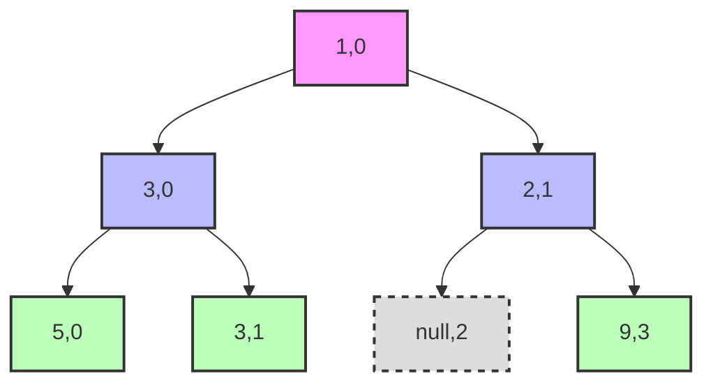

## Explanation: Maximum Width of Binary Tree

### Analysis of problem & input data

This problem involves finding the maximum width of a binary tree, where width is defined as the length between the leftmost and rightmost non-null nodes at each level, including null nodes in between. The key aspects to consider are:

1. Tree structure: We're dealing with a binary tree, which suggests we might need to use tree traversal techniques.
2. Level-wise processing: The width is calculated per level, indicating we should consider level-order traversal (breadth-first search).
3. Node positioning: The width calculation includes null nodes, which implies we need a way to track node positions within each level.
4. Range consideration: The answer is guaranteed to be within a 32-bit signed integer range, which hints at potential overflow issues we need to be aware of.

The key principle that makes this question simple is the realization that we can assign position values to each node based on its location in a theoretical complete binary tree. For a node at position `i`, its left child would be at position `2i` and its right child at `2i + 1`. This allows us to calculate the width at each level without explicitly counting null nodes.

### Test cases

Here are some relevant test cases:

1. Regular binary tree:

   ```
     1
   /   \
   3     2
   / \     \
   5   3     9
   ```

   Expected output: 4

2. Skewed tree (left-skewed):

   ```
   1
   /
   2
   /
   3
   ```

   Expected output: 1

3. Skewed tree (right-skewed):

   ```
   1
    \
     2
      \
       3
   ```

   Expected output: 1

4. Complete binary tree:

   ```
     1
   /   \
   2     3
   / \   / \
   4   5 6   7
   ```

   Expected output: 4

5. Tree with large level difference:

   ```
        1
       / \
      2   3
     /     \
    4       5
   /         \
   6           7
   /             \
   8               9
   ```

   Expected output: 8

6. Empty tree:
   ```
   null
   ```
   Expected output: 0

Here's the Python code for these test cases:

```python
class TreeNode:
    def __init__(self, val=0, left=None, right=None):
        self.val = val
        self.left = left
        self.right = right

def create_tree(values):
    if not values:
        return None
    root = TreeNode(values[0])
    queue = [root]
    i = 1
    while queue and i < len(values):
        node = queue.pop(0)
        if i < len(values) and values[i] is not None:
            node.left = TreeNode(values[i])
            queue.append(node.left)
        i += 1
        if i < len(values) and values[i] is not None:
            node.right = TreeNode(values[i])
            queue.append(node.right)
        i += 1
    return root

# Test cases
test_cases = [
    [1,3,2,5,3,None,9],  # Regular binary tree
    [1,2,None,3],        # Left-skewed tree
    [1,None,2,None,None,None,3],  # Right-skewed tree
    [1,2,3,4,5,6,7],     # Complete binary tree
    [1,2,3,4,None,None,5,6,None,None,None,None,None,None,7,8,None,None,None,None,None,None,None,None,None,None,None,None,None,9],  # Tree with large level difference
    []                   # Empty tree
]

# Function to test (placeholder, actual implementation will be provided in solutions)
def maxWidth(root: TreeNode) -> int:
    pass  # Placeholder for actual implementation

# Run test cases
for i, case in enumerate(test_cases):
    root = create_tree(case)
    result = maxWidth(root)
    print(f"Test case {i+1}: {result}")
```

### Solutions

#### Overview of solution approaches

##### Solutions worth learning

1. BFS with level-wise position tracking (Neetcode solution)
2. DFS with position tracking
3. BFS with null node counting

Count: 3 solutions (1 Neetcode solution)

##### Rejected solutions

1. Naive BFS without position tracking: This approach would involve counting all nodes (including nulls) at each level, which is inefficient and prone to errors.
2. Recursive approach without position tracking: This would make it difficult to calculate the width accurately, especially for sparse trees.

#### Worthy Solutions

##### BFS with level-wise position tracking (Neetcode solution)

```python
from collections import deque
from typing import Optional

class TreeNode:
    def __init__(self, val=0, left=None, right=None):
        self.val = val
        self.left = left
        self.right = right

def widthOfBinaryTree(root: Optional[TreeNode]) -> int:
    if not root:
        return 0

    max_width = 0
    queue = deque([(root, 0)])  # (node, position)

    while queue:
        level_start = queue[0][1]  # Position of the leftmost node
        level_end = queue[-1][1]   # Position of the rightmost node
        max_width = max(max_width, level_end - level_start + 1)

        for _ in range(len(queue)):
            node, position = queue.popleft()

            # Left child position: 2 * position
            if node.left:
                queue.append((node.left, 2 * position))

            # Right child position: 2 * position + 1
            if node.right:
                queue.append((node.right, 2 * position + 1))

    return max_width
```

Time Complexity: O(N), where N is the number of nodes in the tree.
Space Complexity: O(W), where W is the maximum width of the tree.

Explanation:

- We traverse the tree level by level (BFS), which takes O(N) time as we visit each node once.
- The space complexity is O(W) because in the worst case, we store all nodes of the widest level in the queue.

This solution leverages the following intuitions and invariants:

- Each node is assigned a position as if the tree were a complete binary tree.
- The width of a level is the difference between the rightmost and leftmost node positions, plus one.
- By using BFS, we ensure that we process nodes level by level, allowing us to calculate the width for each level.
- The maximum width across all levels is maintained and updated as we traverse.

##### DFS with position tracking

```python
from typing import Optional

class TreeNode:
    def __init__(self, val=0, left=None, right=None):
        self.val = val
        self.left = left
        self.right = right

def widthOfBinaryTree(root: Optional[TreeNode]) -> int:
    def dfs(node: Optional[TreeNode], depth: int, position: int) -> None:
        if not node:
            return

        # If this is the first node we've seen at this depth,
        # record its position as the leftmost node
        if depth not in left_most:
            left_most[depth] = position

        # Update the maximum width
        nonlocal max_width
        max_width = max(max_width, position - left_most[depth] + 1)

        # Recursively process children
        dfs(node.left, depth + 1, position * 2)
        dfs(node.right, depth + 1, position * 2 + 1)

    max_width = 0
    left_most = {}  # Stores the leftmost position for each depth
    dfs(root, 0, 0)
    return max_width
```

Time Complexity: O(N), where N is the number of nodes in the tree.
Space Complexity: O(H), where H is the height of the tree.

Explanation:

- We traverse the tree using DFS, which takes O(N) time as we visit each node once.
- The space complexity is O(H) due to the recursion stack in the worst case of a skewed tree.

This solution leverages the following intuitions and invariants:

- Each node is assigned a position as if the tree were a complete binary tree.
- We keep track of the leftmost node's position for each depth.
- The width at each depth is calculated as the difference between the current node's position and the leftmost node's position at that depth, plus one.
- DFS allows us to explore all paths in the tree, ensuring we consider all possible widths.

##### BFS with null node counting

```python
from collections import deque
from typing import Optional

class TreeNode:
    def __init__(self, val=0, left=None, right=None):
        self.val = val
        self.left = left
        self.right = right

def widthOfBinaryTree(root: Optional[TreeNode]) -> int:
    if not root:
        return 0

    max_width = 0
    queue = deque([root])

    while queue:
        level_size = len(queue)
        null_count = 0
        level_width = 0

        for i in range(level_size):
            node = queue.popleft()

            if node:
                level_width = i - null_count + 1
                queue.append(node.left)
                queue.append(node.right)
            else:
                null_count += 1
                queue.append(None)
                queue.append(None)

        # Remove trailing None values
        while queue and queue[-1] is None:
            queue.pop()

        max_width = max(max_width, level_width)

        if all(node is None for node in queue):
            break

    return max_width
```

Time Complexity: O(N), where N is the number of nodes in the tree.
Space Complexity: O(W), where W is the maximum width of the tree.

Explanation:

- We traverse the tree level by level (BFS), which takes O(N) time as we visit each node once.
- The space complexity is O(W) because in the worst case, we store all nodes (including nulls) of the widest level in the queue.

This solution leverages the following intuitions and invariants:

- We explicitly count null nodes at each level to determine the width.
- The width of a level is calculated by subtracting the number of leading null nodes from the index of the last non-null node, plus one.
- By using BFS, we ensure that we process nodes level by level, allowing us to calculate the width for each level.
- Trailing null nodes are removed at the end of each level to prevent unnecessary processing.

#### Rejected Approaches

1. Naive BFS without position tracking:
   This approach would involve storing all nodes (including nulls) at each level and counting them. It's rejected because:

   - It's inefficient in terms of space complexity, potentially O(2^H) for a complete binary tree.
   - It's prone to errors when dealing with sparse trees, as it might count unnecessary null nodes.

2. Recursive approach without position tracking:
   This method would attempt to calculate the width by recursively traversing the tree without assigning positions to nodes. It's rejected because:
   - It makes it difficult to accurately calculate the width, especially for sparse trees.
   - It would likely require multiple passes through the tree, increasing time complexity.

#### Final Recommendations

The BFS with level-wise position tracking (Neetcode solution) is the best to learn for several reasons:

1. It's intuitive and easy to understand, mapping well to the problem description.
2. It has optimal time complexity O(N) and space complexity O(W).
3. It avoids potential integer overflow issues by calculating width at each level.
4. It's the most straightforward to implement and explain in an interview setting.

This solution demonstrates a good balance between efficiency and clarity, making it an excellent choice for learning and interview preparation.

### Visualization(s)

To help visualize the BFS with level-wise position tracking approach, let's create a simple diagram:



In this visualization:

- Each node is labelled with its value and position (value,position).
- The position is calculated as described in the solution: left child is 2*parent_position, right child is 2*parent_position + 1.
- The width at each level is the difference between the rightmost and leftmost non-null node positions, plus one.
- Level 0 (root): Width = 0 - 0 + 1 = 1
- Level 1: Width = 1 - 0 + 1 = 2
- Level 2: Width = 3 - 0 + 1 = 4

The maximum width is 4, occurring at level 2.

This visualization helps to understand how the position tracking works and how it relates to the width calculation at each level.
