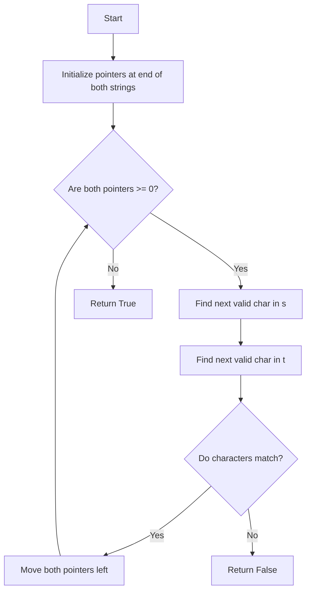

Certainly! Let's explore different solutions to the "Backspace String Compare" problem, analyze their time and space complexities, and provide visualizations where helpful.

Solution 1: Stack-based approach

Let's start with a straightforward solution using stacks:

```python
from typing import List

def backspace_compare(s: str, t: str) -> bool:
    def process_string(string: str) -> List[str]:
        stack = []
        for char in string:
            if char != '#':
                stack.append(char)  # Add non-backspace characters to the stack
            elif stack:
                stack.pop()  # Remove the last character if it's a backspace and stack is not empty
        return stack

    return process_string(s) == process_string(t)

# Test cases
print(backspace_compare("ab#c", "ad#c"))  # True
print(backspace_compare("ab##", "c#d#"))  # True
print(backspace_compare("a#c", "b"))  # False

```

Explanation:

1. We define a helper function `process_string` that uses a stack to process each string.
2. For each character in the string:
   - If it's not a '#', we append it to the stack.
   - If it's a '#' and the stack is not empty, we pop the last character from the stack.
3. After processing both strings, we compare the resulting stacks.

Time Complexity: O(n), where n is the length of the longer string.
Space Complexity: O(n) in the worst case, where we might need to store all characters in the stack.

Solution 2: Two-pointer approach (Optimal)

Now, let's implement a solution that meets the follow-up challenge of O(n) time and O(1) space:

```python
def backspace_compare(s: str, t: str) -> bool:
    def next_valid_char(string: str, index: int) -> int:
        backspace_count = 0
        while index >= 0:
            if string[index] == '#':
                backspace_count += 1
            elif backspace_count > 0:
                backspace_count -= 1
            else:
                return index
            index -= 1
        return index

    index_s, index_t = len(s) - 1, len(t) - 1

    while index_s >= 0 or index_t >= 0:
        index_s = next_valid_char(s, index_s)
        index_t = next_valid_char(t, index_t)

        if index_s >= 0 and index_t >= 0 and s[index_s] != t[index_t]:
            return False
        if (index_s >= 0) != (index_t >= 0):
            return False

        index_s -= 1
        index_t -= 1

    return True

# Test cases
print(backspace_compare("ab#c", "ad#c"))  # True
print(backspace_compare("ab##", "c#d#"))  # True
print(backspace_compare("a#c", "b"))  # False

```

Explanation:

1. We use two pointers, starting from the end of each string.
2. The `next_valid_char` function finds the next valid character (accounting for backspaces) from a given index.
3. We compare characters from right to left, skipping characters that would be deleted by backspaces.
4. If at any point the valid characters don't match, or one string runs out of characters before the other, we return False.
5. If we make it through both strings without finding a mismatch, we return True.

Time Complexity: O(n), where n is the length of the longer string.
Space Complexity: O(1), as we only use a constant amount of extra space.

This solution is optimal in terms of both time and space complexity, meeting the follow-up challenge.

Visualization:

To help understand the two-pointer approach, let's create a simple visualization:



This diagram illustrates the flow of the two-pointer approach:

1. We start with pointers at the end of both strings.
2. We continually find the next valid character in each string (accounting for backspaces).
3. If the characters match, we move both pointers left and continue.
4. If they don't match, we return False.
5. If we've processed all characters in both strings without finding a mismatch, we return True.

Recommendation:

I recommend learning and implementing the two-pointer approach (Solution 2) for several reasons:

1. It meets the follow-up challenge of O(n) time and O(1) space complexity.
2. It demonstrates an elegant way to solve string manipulation problems without extra space.
3. The technique of moving from right to left in a string is a valuable pattern to understand for other problems.
4. It provides practice with more advanced pointer manipulation, which is a crucial skill in many algorithms.

While the stack-based solution is more intuitive and easier to implement, the two-pointer solution showcases a more optimized approach that could be crucial in interviews or when dealing with large-scale problems where memory usage is a concern.
