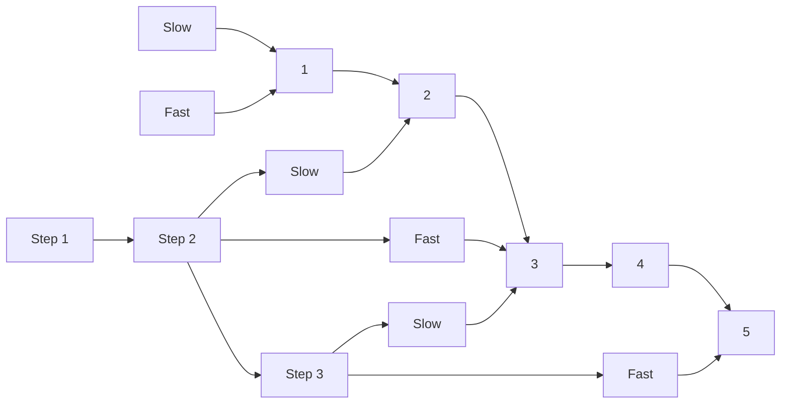

Certainly! Let's explore different solutions to the "Middle of the Linked List" problem and analyze their complexity. We'll start with the most straightforward solution and then move on to more optimized approaches.

Solution 1: Two-pass approach

```python
from typing import Optional

class ListNode:
    def __init__(self, val=0, next=None):
        self.val = val
        self.next = next

class Solution:
    def middleNode(self, head: Optional[ListNode]) -> Optional[ListNode]:
        # First pass: count the number of nodes
        count = 0
        current = head
        while current:
            count += 1
            current = current.next

        # Calculate the index of the middle node
        middle_index = count // 2

        # Second pass: traverse to the middle node
        current = head
        for _ in range(middle_index):
            current = current.next

        return current

# Test cases
def create_linked_list(values):
    dummy = ListNode(0)
    current = dummy
    for val in values:
        current.next = ListNode(val)
        current = current.next
    return dummy.next

def print_linked_list(head):
    values = []
    while head:
        values.append(head.val)
        head = head.next
    print(values)

# Test case 1
head1 = create_linked_list([1, 2, 3, 4, 5])
solution = Solution()
result1 = solution.middleNode(head1)
print("Test case 1 result:")
print_linked_list(result1)

# Test case 2
head2 = create_linked_list([1, 2, 3, 4, 5, 6])
result2 = solution.middleNode(head2)
print("Test case 2 result:")
print_linked_list(result2)

```

Explanation:

1. This solution uses two passes through the linked list.
2. In the first pass, we count the total number of nodes.
3. We calculate the index of the middle node (count // 2).
4. In the second pass, we traverse to the middle node.

Time Complexity: O(n), where n is the number of nodes in the linked list. We traverse the list twice.
Space Complexity: O(1), as we only use a constant amount of extra space.

Solution 2: Fast and Slow Pointer (Tortoise and Hare)

```python
from typing import Optional

class ListNode:
    def __init__(self, val=0, next=None):
        self.val = val
        self.next = next

class Solution:
    def middleNode(self, head: Optional[ListNode]) -> Optional[ListNode]:
        # Initialize slow and fast pointers
        slow = fast = head

        # Move slow pointer one step and fast pointer two steps at a time
        while fast and fast.next:
            slow = slow.next
            fast = fast.next.next

        # When fast reaches the end, slow will be at the middle
        return slow

# Test cases
def create_linked_list(values):
    dummy = ListNode(0)
    current = dummy
    for val in values:
        current.next = ListNode(val)
        current = current.next
    return dummy.next

def print_linked_list(head):
    values = []
    while head:
        values.append(head.val)
        head = head.next
    print(values)

# Test case 1
head1 = create_linked_list([1, 2, 3, 4, 5])
solution = Solution()
result1 = solution.middleNode(head1)
print("Test case 1 result:")
print_linked_list(result1)

# Test case 2
head2 = create_linked_list([1, 2, 3, 4, 5, 6])
result2 = solution.middleNode(head2)
print("Test case 2 result:")
print_linked_list(result2)

```

Explanation:

1. This solution uses the "Fast and Slow Pointer" technique, also known as the "Tortoise and Hare" algorithm.
2. We initialize two pointers, `slow` and `fast`, both pointing to the head of the list.
3. In each iteration, we move the `slow` pointer one step and the `fast` pointer two steps.
4. When the `fast` pointer reaches the end of the list (or the last node in case of even length), the `slow` pointer will be at the middle node.

Time Complexity: O(n), where n is the number of nodes in the linked list. We traverse the list only once.
Space Complexity: O(1), as we only use two pointers regardless of the list size.

Recommendation:
The Fast and Slow Pointer approach (Solution 2) is the recommended solution to learn for this problem. Here's why:

1. It's more efficient, requiring only one pass through the list instead of two.
2. It's a widely applicable technique used in many linked list problems.
3. It's more elegant and concise, making it easier to implement and less prone to errors.

To help visualize the Fast and Slow Pointer approach, let's create a simple diagram using Mermaid:



This diagram shows how the slow and fast pointers move through the linked list. The slow pointer (in blue) moves one step at a time, while the fast pointer (in red) moves two steps. When the fast pointer reaches the end, the slow pointer will be at the middle node.

Test Cases:
Both solutions include test cases for the examples provided in the problem statement. You can run these test cases to verify the correctness of the implementations.

In conclusion, while both solutions correctly solve the problem, the Fast and Slow Pointer approach (Solution 2) is more efficient and elegant. It's a valuable technique to master for linked list problems in general.
