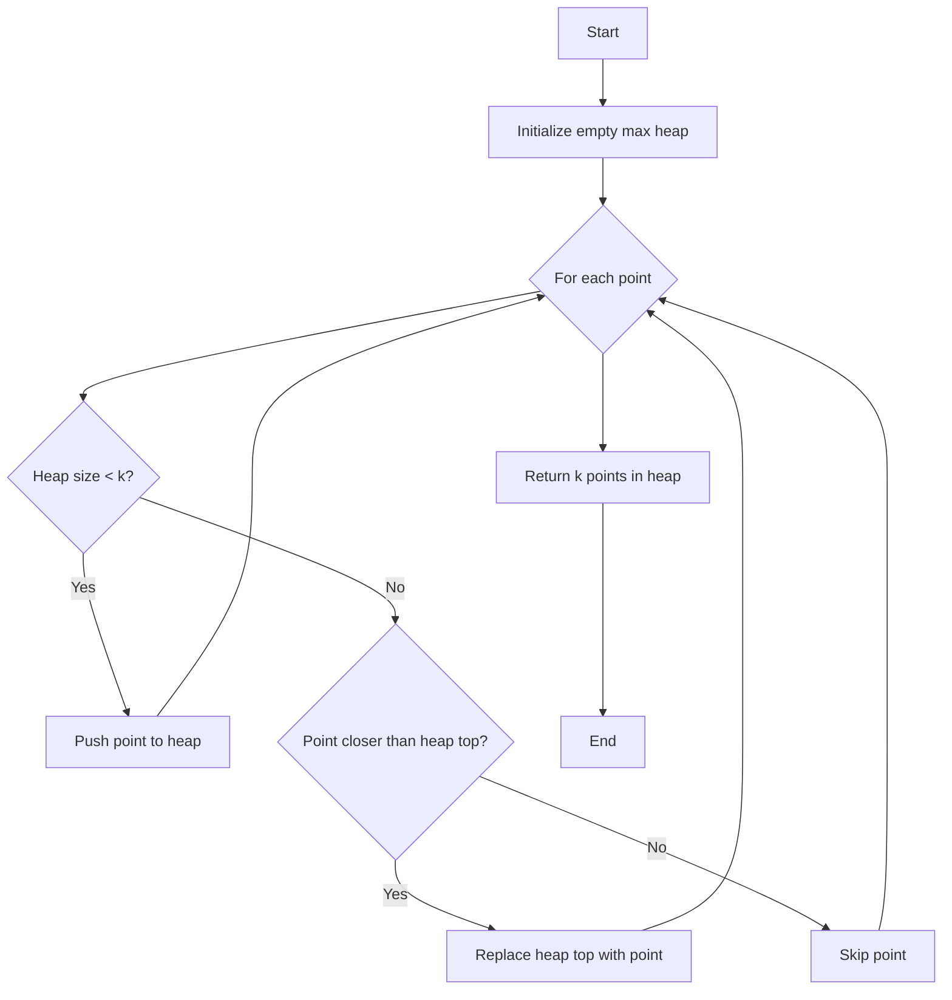

Thank you for providing this interesting problem! Let's explore different solutions to find the k closest points to the origin. I'll provide multiple approaches, explain their time and space complexities, and recommend the best solution to learn.

Solution 1: Sorting Approach

Let's start with a straightforward solution using sorting.

```python
from typing import List
import math

class Solution:
    def kClosest(self, points: List[List[int]], k: int) -> List[List[int]]:
        # Calculate the distance of each point from the origin
        # and store it along with the point
        distances = [(math.sqrt(x**2 + y**2), [x, y]) for x, y in points]

        # Sort the points based on their distances
        distances.sort(key=lambda x: x[0])

        # Return the k closest points
        return [point for _, point in distances[:k]]

# Test cases
solution = Solution()
print(solution.kClosest([[1,3],[-2,2]], 1))  # Output: [[-2,2]]
print(solution.kClosest([[3,3],[5,-1],[-2,4]], 2))  # Output: [[3,3],[-2,4]] or [[-2,4],[3,3]]

```

Explanation:

1. We calculate the Euclidean distance of each point from the origin (0, 0) using the formula √(x² + y²).
2. We store each distance along with its corresponding point in a list.
3. We sort this list based on the distances.
4. Finally, we return the first k points from the sorted list.

Time Complexity: O(n log n), where n is the number of points. This is due to the sorting operation.
Space Complexity: O(n) to store the distances list.

Solution 2: Max Heap Approach

Now, let's look at a more efficient solution using a max heap.

```python
from typing import List
import heapq

class Solution:
    def kClosest(self, points: List[List[int]], k: int) -> List[List[int]]:
        # Use a max heap to keep track of the k closest points
        heap = []

        for (x, y) in points:
            # Calculate the negative distance (for max heap behavior)
            dist = -(x*x + y*y)

            if len(heap) < k:
                # If we haven't filled the heap yet, add the point
                heapq.heappush(heap, (dist, x, y))
            elif dist > heap[0][0]:
                # If this point is closer than the furthest point in our heap,
                # remove the furthest point and add this one
                heapq.heapreplace(heap, (dist, x, y))

        # Return the k points in the heap
        return [[x, y] for (dist, x, y) in heap]

# Test cases
solution = Solution()
print(solution.kClosest([[1,3],[-2,2]], 1))  # Output: [[-2,2]]
print(solution.kClosest([[3,3],[5,-1],[-2,4]], 2))  # Output: [[3,3],[-2,4]] or [[-2,4],[3,3]]

```

Explanation:

1. We use a max heap to keep track of the k closest points.
2. We iterate through all points, calculating their squared distance from the origin.
3. We use the negative of this distance as the key for our max heap, so that the point with the largest negative distance (i.e., the point furthest from the origin) is always at the top of the heap.
4. If we haven't yet found k points, we add the current point to the heap.
5. If we have k points and the current point is closer to the origin than the furthest point in our heap, we remove the furthest point and add the current point.
6. At the end, our heap contains the k closest points.

Time Complexity: O(n log k), where n is the number of points. We perform a heap operation for each point, and our heap is limited to size k.
Space Complexity: O(k) to store the heap.

Solution 3: QuickSelect Approach

Finally, let's look at an optimal solution using the QuickSelect algorithm.

```python
from typing import List
import random

class Solution:
    def kClosest(self, points: List[List[int]], k: int) -> List[List[int]]:
        def distance(point):
            return point[0]**2 + point[1]**2

        def partition(left, right, pivot_idx):
            pivot = distance(points[pivot_idx])
            # Move pivot to end
            points[pivot_idx], points[right] = points[right], points[pivot_idx]
            store_idx = left
            for i in range(left, right):
                if distance(points[i]) < pivot:
                    points[store_idx], points[i] = points[i], points[store_idx]
                    store_idx += 1
            # Move pivot to its final place
            points[right], points[store_idx] = points[store_idx], points[right]
            return store_idx

        def select(left, right):
            if left == right:
                return

            # Select a random pivot
            pivot_idx = random.randint(left, right)

            # Find the pivot position in a sorted list
            pivot_idx = partition(left, right, pivot_idx)

            # If the pivot is in its final sorted position,
            # recursively sort the left and right portions
            if k == pivot_idx:
                return
            elif k < pivot_idx:
                select(left, pivot_idx - 1)
            else:
                select(pivot_idx + 1, right)

        select(0, len(points) - 1)
        return points[:k]

# Test cases
solution = Solution()
print(solution.kClosest([[1,3],[-2,2]], 1))  # Output: [[-2,2]]
print(solution.kClosest([[3,3],[5,-1],[-2,4]], 2))  # Output: [[3,3],[-2,4]] or [[-2,4],[3,3]]

```

Explanation:

1. We use the QuickSelect algorithm, which is similar to QuickSort but only recursively processes one side of the pivot.
2. We define a partition function that chooses a pivot and partitions the array around it.
3. We recursively select the kth element, which will be in its final sorted position.
4. Once we've found the kth element, we know that all elements before it are closer to the origin, so we return the first k elements.

Time Complexity: O(n) on average, where n is the number of points. In the worst case, it can be O(n²), but this is rare due to the random pivot selection.
Space Complexity: O(1) as we're sorting in-place.

Recommendation:
I would recommend learning the Max Heap approach (Solution 2) for this problem. Here's why:

1. It offers a good balance between efficiency and simplicity. Its time complexity of O(n log k) is better than the sorting approach for large datasets when k is significantly smaller than n.

2. It introduces the concept of heaps, which is a fundamental data structure used in many algorithms and real-world applications.

3. It's more intuitive than the QuickSelect approach and easier to implement correctly in a high-pressure situation like an interview.

4. It's a versatile approach that can be easily modified to solve variations of this problem, such as finding the k-th closest point or maintaining a stream of points.

The QuickSelect approach, while theoretically more efficient, is more complex and prone to errors in implementation. It's a great algorithm to know, but for this specific problem, the heap approach offers a good trade-off between efficiency and simplicity.

To visualize how the max heap approach works, let's create a simple diagram:



This diagram illustrates the flow of the max heap approach:

1. We start with an empty max heap.
2. For each point, we check if the heap size is less than k.
3. If it is, we simply add the point to the heap.
4. If not, we compare the point's distance to the distance of the point at the top of the heap (the furthest point we've seen so far).
5. If the new point is closer, we replace the top of the heap with this new point.
6. If it's further, we skip it.
7. After processing all points, the heap contains the k closest points.

This visual representation should help in understanding the logic behind the max heap approach.
