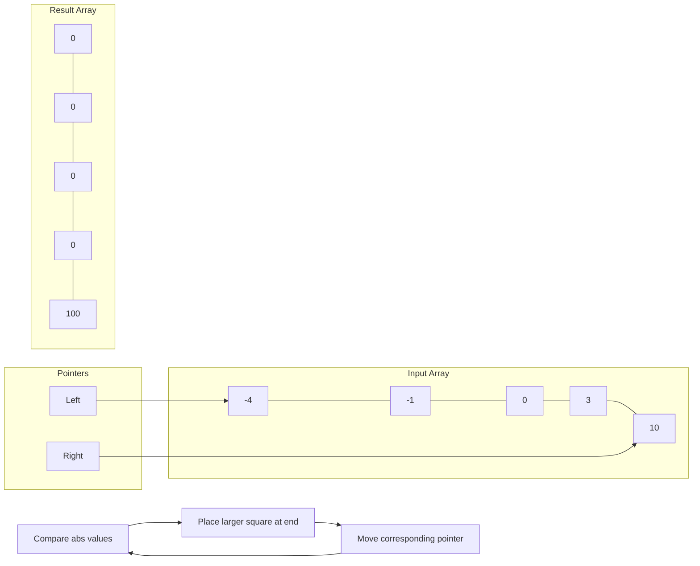

Certainly! Let's explore different solutions for the "Squares of a Sorted Array" problem, discussing their time and space complexities, and then recommend the best approach to learn.

1. Naive Approach: Square and Sort

Let's start with the most straightforward solution:

```python
from typing import List

def sortedSquares(nums: List[int]) -> List[int]:
    # Square each number in the input array
    squared = [num * num for num in nums]

    # Sort the squared numbers
    return sorted(squared)

# Test cases
test_cases = [
    [-4, -1, 0, 3, 10],
    [-7, -3, 2, 3, 11],
    [0],
    [-5, -3, -2, -1]
]

for case in test_cases:
    print(f"Input: {case}")
    print(f"Output: {sortedSquares(case)}")
    print()

```

Time Complexity: O(n log n), where n is the length of the input array. This is due to the sorting step.
Space Complexity: O(n) to store the new array of squared numbers.

This approach is simple but not optimal in terms of time complexity.

2. Two-Pointer Approach

Now, let's look at a more efficient solution that takes advantage of the sorted nature of the input array:

```python
from typing import List

def sortedSquares(nums: List[int]) -> List[int]:
    n = len(nums)
    result = [0] * n  # Initialize result array with zeros
    left, right = 0, n - 1  # Two pointers: left at start, right at end

    for i in range(n - 1, -1, -1):  # Fill result array from right to left
        if abs(nums[left]) > abs(nums[right]):
            result[i] = nums[left] * nums[left]
            left += 1
        else:
            result[i] = nums[right] * nums[right]
            right -= 1

    return result

# Test cases
test_cases = [
    [-4, -1, 0, 3, 10],
    [-7, -3, 2, 3, 11],
    [0],
    [-5, -3, -2, -1]
]

for case in test_cases:
    print(f"Input: {case}")
    print(f"Output: {sortedSquares(case)}")
    print()

```

Time Complexity: O(n), where n is the length of the input array. We traverse the array once.
Space Complexity: O(n) to store the result array.

This approach is more efficient as it takes advantage of the sorted nature of the input array and achieves linear time complexity.

To visualize this algorithm, let's create a simple diagram:



This diagram shows the initial state of the algorithm. The process continues by comparing the absolute values at the left and right pointers, placing the larger square at the end of the result array, and moving the corresponding pointer.

Recommendation:
I would recommend learning and mastering the Two-Pointer Approach (Solution 2) for this problem. Here's why:

1. Optimal Time Complexity: It achieves O(n) time complexity, which is the best possible for this problem as we need to process each element at least once.
2. Utilizes Problem Constraints: It takes advantage of the sorted nature of the input array, which is a key aspect of the problem.
3. In-Place Calculation: While it does use extra space for the result, it calculates the squares in-place without needing an intermediate array.
4. Two-Pointer Technique: This is a common technique in array and string problems, so mastering it here will be beneficial for solving other problems.
5. No Built-in Sort: It doesn't rely on built-in sorting functions, which helps in understanding how to manually manipulate arrays to achieve the desired order.

The naive approach is simpler to understand and implement, but it doesn't take full advantage of the problem's constraints. The two-pointer approach, while slightly more complex, is more efficient and demonstrates a valuable problem-solving technique that can be applied to many other problems.

Would you like me to explain any part of these solutions in more detail?
