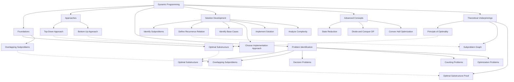

# Dynamic Programming: A Comprehensive Explainer



## 1. Foundations of Dynamic Programming

### 1.1 Optimal Substructure

At the core of dynamic programming lies the concept of **optimal substructure**. A problem exhibits optimal substructure if:

- An optimal solution to the problem contains optimal solutions to its subproblems.

This property allows us to break down complex problems into simpler, manageable subproblems.

### 1.2 Overlapping Subproblems

The second crucial property is **overlapping subproblems**:

- The same subproblems are encountered multiple times when solving the original problem.

This property enables us to store and reuse solutions to subproblems, avoiding redundant computations.

## 2. The Dynamic Programming Paradigm

Dynamic Programming (DP) is an algorithmic paradigm that:

1. Breaks down a problem into simpler subproblems
2. Stores the results of these subproblems
3. Reuses these results to solve larger instances of the problem

The key idea is to trade space for time, using additional memory to store intermediate results and avoid recomputation.

## 3. Approaches to Dynamic Programming

There are two main approaches to implementing dynamic programming solutions:

### 3.1 Top-Down Approach (Memoization)

- Start with the original problem
- Recursively break it down into subproblems
- Store results of subproblems in a data structure (usually a dictionary or array)
- Before computing a subproblem, check if its result is already stored

```python
def fibonacci_top_down(n, memo={}):
    if n in memo:
        return memo[n]
    if n <= 1:
        return n
    memo[n] = fibonacci_top_down(n-1, memo) + fibonacci_top_down(n-2, memo)
    return memo[n]
```

### 3.2 Bottom-Up Approach (Tabulation)

- Start with the smallest subproblems
- Iteratively build up solutions to larger subproblems
- Store results in a table (usually an array)
- Use previously computed results to solve larger problems

```python
def fibonacci_bottom_up(n):
    if n <= 1:
        return n
    dp = [0] * (n + 1)
    dp[1] = 1
    for i in range(2, n + 1):
        dp[i] = dp[i-1] + dp[i-2]
    return dp[n]
```

## 4. Existence of Both Approaches

In theory, both top-down and bottom-up approaches exist for any dynamic programming problem. However, one approach may be more natural or efficient for a given problem.

- **Top-down** is often more intuitive, as it mimics the natural recursive structure of the problem.
- **Bottom-up** can be more efficient in terms of space and time, as it avoids the overhead of recursive function calls.

The choice between the two often depends on the specific problem characteristics and implementation constraints.

## 5. Identifying Dynamic Programming Problems

To recognize problems suitable for dynamic programming, look for:

1. **Optimal Substructure**: Can the problem be broken down into simpler subproblems?
2. **Overlapping Subproblems**: Are the same subproblems solved multiple times?
3. **Decision Problem**: Does the problem involve making a series of interconnected decisions?
4. **Counting Problems**: Does the problem involve counting the number of ways to do something?
5. **Optimization Problems**: Does the problem ask for a maximum or minimum value?

## 6. Steps to Develop a Dynamic Programming Solution

1. **Identify the subproblems**: Define the smallest instance of the problem.
2. **Define the recurrence relation**: Express the solution to a problem in terms of solutions to smaller subproblems.
3. **Identify the base cases**: Determine the simplest instances of the problem that can be solved directly.
4. **Choose the implementation approach**: Decide between top-down or bottom-up based on the problem characteristics.
5. **Implement the solution**: Write the code, ensuring efficient storage and retrieval of subproblem solutions.
6. **Analyze time and space complexity**: Determine the efficiency of your solution.

## 7. Advanced Concepts in Dynamic Programming

### 7.1 State Reduction

In some DP problems, we can reduce the state space by identifying redundant or unnecessary information. This can lead to more efficient solutions in terms of both time and space.

### 7.2 Divide and Conquer DP

This technique combines the divide-and-conquer paradigm with dynamic programming. It's useful when the recurrence relation has a monotonicity property that allows us to efficiently determine split points.

### 7.3 Convex Hull Optimization

This optimization technique applies to dynamic programming problems where the recurrence involves a linear function minimization over a range of possibilities.

## 8. Theoretical Underpinnings

### 8.1 Principle of Optimality

The principle of optimality, formulated by Richard Bellman, states that:

"An optimal policy has the property that whatever the initial state and initial decision are, the remaining decisions must constitute an optimal policy with regard to the state resulting from the first decision."

This principle forms the theoretical basis for the correctness of dynamic programming algorithms.

### 8.2 Subproblem Graph

We can visualize the structure of a dynamic programming problem as a directed acyclic graph (DAG) where:

- Nodes represent subproblems
- Edges represent dependencies between subproblems

The time complexity of a DP algorithm is often proportional to the number of edges in this graph.

### 8.3 Optimal Substructure Proof

To rigorously prove that a problem has optimal substructure:

1. Assume an optimal solution exists for the problem.
2. Show that this optimal solution must contain optimal solutions to its subproblems.
3. Prove by contradiction: If any subproblem solution is not optimal, we can improve the overall solution, contradicting its optimality.

## 9. Conclusion

Dynamic Programming is a powerful technique that can solve a wide range of optimization problems efficiently. By breaking down complex problems into simpler subproblems and reusing their solutions, DP algorithms can achieve polynomial time complexity for problems that would otherwise require exponential time.

The key to mastering dynamic programming lies in recognizing its applicability, understanding the problem structure, and choosing the appropriate implementation approach. With practice, you'll develop an intuition for identifying and solving DP problems efficiently.
