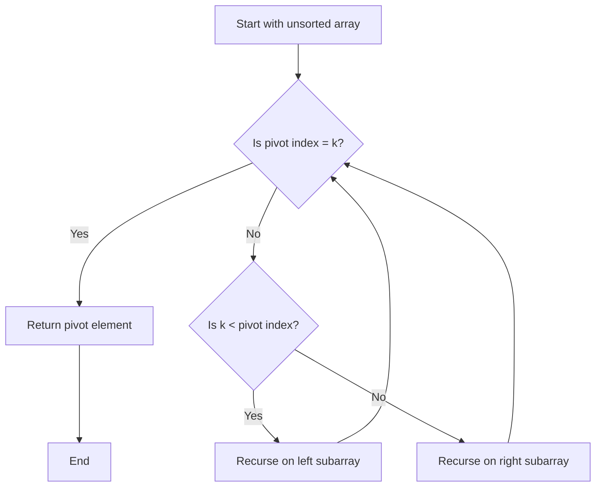

Certainly! I'd be happy to explain the QuickSelect algorithm in greater detail. QuickSelect is an efficient algorithm for finding the kth smallest (or largest) element in an unsorted list. It's particularly useful for problems like finding the k closest points to the origin, as in our case.

Let's break down the algorithm step by step:

1. Basic Idea:
   QuickSelect is based on the partitioning idea from QuickSort. However, instead of recursing into both sides as in QuickSort, QuickSelect only recurses into one side – the side that contains the kth element.

2. The Algorithm:

```python
def quickselect(arr, k):
    def partition(left, right, pivot_idx):
        pivot = arr[pivot_idx]
        # Move pivot to end
        arr[pivot_idx], arr[right] = arr[right], arr[pivot_idx]
        store_idx = left
        for i in range(left, right):
            if arr[i] < pivot:
                arr[store_idx], arr[i] = arr[i], arr[store_idx]
                store_idx += 1
        # Move pivot to its final place
        arr[right], arr[store_idx] = arr[store_idx], arr[right]
        return store_idx

    def select(left, right):
        if left == right:
            return arr[left]

        pivot_idx = (left + right) // 2  # Can also be random
        pivot_idx = partition(left, right, pivot_idx)

        if k == pivot_idx:
            return arr[k]
        elif k < pivot_idx:
            return select(left, pivot_idx - 1)
        else:
            return select(pivot_idx + 1, right)

    return select(0, len(arr) - 1)

# Example usage
arr = [3, 2, 1, 5, 6, 4]
k = 2  # Find the 2nd smallest element
print(quickselect(arr, k-1))  # Output: 2

```

Now, let's break down the key steps:

a) Partition Function:

- Choose a pivot element (can be random, first, last, or median-of-three).
- Rearrange the array so that all elements less than the pivot come before it, and all elements greater come after it.
- Return the final position of the pivot.

b) Select Function:

- If the pivot's position is equal to k, we've found our element.
- If k is less than the pivot's position, recurse on the left subarray.
- If k is greater than the pivot's position, recurse on the right subarray.

3. Visual Representation:



4. Time Complexity:

   - Average case: O(n)
   - Worst case: O(n^2) (rare with good pivot selection)

   The average case of O(n) comes from the fact that, on average, we're eliminating half of the remaining elements in each recursive step.

5. Space Complexity:

   - O(1) for the iterative version
   - O(log n) average case for the recursive version due to the call stack

6. Advantages:

   - Very efficient for finding the kth element or the top k elements.
   - In-place algorithm, requiring no additional storage.

7. Disadvantages:

   - Not stable (doesn't preserve the original order of equal elements).
   - Worst-case time complexity is O(n^2), though this is rare with good pivot selection.

8. Applications:
   - Finding the median of an unsorted array.
   - Finding the top k elements (like in our k closest points problem).
   - Solving order statistics problems.

In the context of our k closest points problem, we use QuickSelect to partition the points array such that the kth point and all points before it are the k closest points to the origin. This allows us to solve the problem in O(n) average time complexity, which is more efficient than sorting the entire array (O(n log n)) when k is significantly smaller than n.

It's worth noting that while QuickSelect is theoretically more efficient, in practice, for smaller datasets or when k is close to n, other methods like sorting or using a heap might be preferred due to their simplicity and good performance with modern hardware and optimized library implementations.
