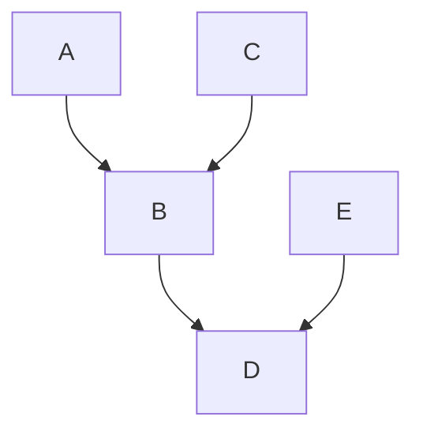

Certainly, I'd be happy to provide a Python explainer on topological sort with implementations of both Depth-First Search (DFS) and Kahn's algorithm approaches. I'll use type hints to enhance legibility. Let's start with a brief explanation and then dive into the implementations.

```python
from typing import Dict, List, Set
from collections import defaultdict, deque

class Graph:
    def __init__(self):
        self.graph: Dict[int, List[int]] = defaultdict(list)

    def add_edge(self, u: int, v: int) -> None:
        self.graph[u].append(v)

def topological_sort_dfs(graph: Graph) -> List[int]:
    def dfs(node: int, visited: Set[int], stack: List[int]) -> None:
        visited.add(node)
        for neighbor in graph.graph[node]:
            if neighbor not in visited:
                dfs(neighbor, visited, stack)
        stack.append(node)

    visited: Set[int] = set()
    stack: List[int] = []

    for node in graph.graph:
        if node not in visited:
            dfs(node, visited, stack)

    return stack[::-1]

def topological_sort_kahn(graph: Graph) -> List[int]:
    in_degree: Dict[int, int] = {node: 0 for node in graph.graph}
    for node in graph.graph:
        for neighbor in graph.graph[node]:
            in_degree[neighbor] += 1

    queue: deque = deque([node for node in in_degree if in_degree[node] == 0])
    result: List[int] = []

    while queue:
        node = queue.popleft()
        result.append(node)
        for neighbor in graph.graph[node]:
            in_degree[neighbor] -= 1
            if in_degree[neighbor] == 0:
                queue.append(neighbor)

    if len(result) != len(graph.graph):
        raise ValueError("Graph contains a cycle")

    return result

# Example usage
if __name__ == "__main__":
    g = Graph()
    g.add_edge(5, 2)
    g.add_edge(5, 0)
    g.add_edge(4, 0)
    g.add_edge(4, 1)
    g.add_edge(2, 3)
    g.add_edge(3, 1)

    print("Topological Sort (DFS):", topological_sort_dfs(g))
    print("Topological Sort (Kahn's):", topological_sort_kahn(g))

```

This code provides implementations of topological sort using both DFS and Kahn's algorithm. Let me explain the key components:

1. Graph class: This class represents a directed graph using an adjacency list.

2. topological_sort_dfs function: This implements the DFS approach.

   - It uses a recursive DFS to explore the graph.
   - Visited nodes are added to a stack after all their neighbors have been explored.
   - The final result is the reverse of this stack.

3. topological_sort_kahn function: This implements Kahn's algorithm.
   - It starts by calculating the in-degree of each node.
   - Nodes with in-degree 0 are added to a queue.
   - The algorithm processes nodes from the queue, decreasing the in-degree of their neighbors.
   - When a node's in-degree becomes 0, it's added to the queue.
   - The process continues until the queue is empty.

Both algorithms return a valid topological ordering if one exists. Kahn's algorithm has the additional benefit of detecting cycles in the graph.

Would you like me to explain any part of the code in more detail?

## Kahn's algorithm implementation in more detail

Certainly! I'd be happy to explain Kahn's algorithm and the concept of "in-degree" in more detail.

Let's start with the concept of "in-degree":

In-degree:
In graph theory, the "in-degree" of a node is the number of edges coming into that node. In other words, it's the count of nodes that directly point to or depend on the current node.

For example, in this simple graph:



- Node A has an in-degree of 0
- Node B has an in-degree of 2 (edges coming from A and C)
- Node D has an in-degree of 2 (edges coming from B and E)
- Nodes C and E have in-degrees of 0

Now, let's break down Kahn's algorithm step by step:

1. Initialize in-degree for all nodes:

   ```python
   in_degree: Dict[int, int] = {node: 0 for node in graph.graph}
   for node in graph.graph:
       for neighbor in graph.graph[node]:
           in_degree[neighbor] += 1
   ```

   This step calculates the in-degree for each node in the graph.

2. Find all nodes with in-degree 0:

   ```python
   queue: deque = deque([node for node in in_degree if in_degree[node] == 0])
   ```

   These are our starting points - nodes that don't depend on any others.

3. Initialize the result list:

   ```python
   result: List[int] = []
   ```

   This will store our topological ordering.

4. Main loop of the algorithm:

   ```python
   while queue:
       node = queue.popleft()
       result.append(node)
       for neighbor in graph.graph[node]:
           in_degree[neighbor] -= 1
           if in_degree[neighbor] == 0:
               queue.append(neighbor)
   ```

   This is the core of Kahn's algorithm:

   - We take a node with in-degree 0 from the queue.
   - We add it to the result (it's safe to process this node as it has no dependencies).
   - We then "remove" this node by decreasing the in-degree of all its neighbors.
   - If any neighbor's in-degree becomes 0, we add it to the queue (it's now safe to process).

5. Check for cycles:

   ```python
   if len(result) != len(graph.graph):
       raise ValueError("Graph contains a cycle")
   ```

   If we can't process all nodes, it means there's a cycle in the graph.

6. Return the result:

   ```python
   return result
   ```

   This is our topological ordering.

The key idea behind Kahn's algorithm is that we can safely process (and remove) any node with in-degree 0, as it doesn't depend on any unprocessed nodes. By repeatedly doing this and updating in-degrees, we generate a valid topological ordering.

Advantages of Kahn's algorithm:

1. It can detect cycles in the graph.
2. It's often easier to understand and implement than the DFS approach.
3. It can be more efficient for sparse graphs.

Would you like me to walk through an example of how this algorithm would process a specific graph? Or do you have any questions about specific parts of the implementation?
